# Fint 핵심 화면 스토리보드

> 최종 업데이트: 2026-03-23 (이슈 #194 서비스명 Fint 통일 + IA 5탭 구조 반영)
> 모바일 기준 375px. ASCII 목업은 실제 레이아웃 가이드용.
> 브랜드 컬러: Primary #0D9488 (Teal, 옵션 B 확정) | 서비스명: Fint

## 작성 규칙

- ASCII 박스 너비: 21자 단일 표준 `┌─────────────────────┐`
- 크레딧 수치는 CONFIG 상수 사용:
  - 면접 완료 보상: +CREDIT_INTERVIEW_COMPLETE (기본값: 5)
  - 후기 작성 보상: +CREDIT_REVIEW_WRITE (기본값: 5)
  - 스트릭 7일 보너스: +CREDIT_STREAK_BONUS_7 (기본값: 10)
  - 페르소나 면접 비용: -CREDIT_PERSONA_INTERVIEW (기본값: 10)
  - 쪽지 발송 비용: -CREDIT_DM_SEND (기본값: 3)
  - Q&A 패턴 열람 비용: -CREDIT_PATTERN (기본값: 3)
  - 스트릭 복구 비용: -CREDIT_STREAK_RECOVER (기본값: 5)
  - 응원 폭탄 발송 비용: -CREDIT_CHEER_SEND (기본값: 2)
  - 연봉 통계 상세 열람 비용: -CREDIT_ANALYTICS_VIEW (기본값: 5)
  - 현직자 크레딧 배분율: CREDIT_PERSONA_CREATOR_SHARE (기본값: 3, CREDIT_PERSONA_INTERVIEW의 30%)
  - 실제 수치는 `services/fint/src/config/credits.ts`에서 관리
- 상태별 목업: 각 화면에 최소 Happy Path + 빈/에러 상태 1개 이상
- 타임존: 스트릭 자정 기준 = 한국 시간(UTC+9)
- 소셜 로그인: 모바일 웹 = 리다이렉트 방식
- color-warning: Error Red #EF4444 (크레딧 부족 경고, Amber가 아님)
- color-coin: Amber #F59E0B (크레딧 표시 전용)

⚠ 접근성 주의: color-coin (#F59E0B)는 흰 배경(#FFFFFF) 위에서 WCAG AA 대비(4.5:1) 미충족 (실제 약 2.4:1). 사용 규칙: 아이콘·뱃지 배경으로만 사용, 흰 배경 위 본문 텍스트 색상으로 직접 사용 금지. 텍스트가 필요한 경우 color-coin 배경 위에 어두운 텍스트(#000) 또는 color-coin을 배경으로 사용.

---

## 화면 인덱스

| 번호 | 화면명 | Phase | 상태 |
|------|--------|-------|------|
| 1 | 온보딩 슬라이드 | MVP | ✅ 완료 |
| 1-2 | 프로필 설정 | MVP | ✅ 완료 |
| 2 | 홈 피드 | Phase 2+ | ✅ 완료 (Phase 2 신규) |
| 3 | 채팅 면접 | MVP | ✅ 완료 |
| 4 | 결과 리포트 | MVP | ✅ 완료 |
| L1 | 로그인 | Phase 1 완료 | ✅ 완료 |
| L2 | 면접 히스토리 | Phase 1 완료 | ✅ 완료 |
| L3 | 자소서 업로드 | Phase 1 완료 | ✅ 완료 |
| 4-1 | 로그인/가입 상세 | Phase 1 | ✅ 완료 |
| 5 | 페르소나 마켓 | Phase 2+ | ✅ 완료 (Phase 2 신규) |
| 6 | 아차포인트 | Phase 2+ | ✅ 완료 |
| 7 | 쪽지 | Phase 1 | ✅ 완료 |
| 8 | 크레딧 충전 | Phase 2+ | ✅ 완료 (Phase 2 신규) |
| 9 | 현직자 온보딩 | Phase 1 | ✅ 완료 |
| 10 | MBTI 카드 | Phase 2+ | ✅ 완료 |
| 11 | 빈 상태/에러 상태 | 전체 | ✅ 완료 |
| 12 | 면접 설정 | Phase 1 | ✅ 완료 |
| 13 | AI 면접관 선택 | Phase 1 | ✅ 완료 |
| 14 | 크레딧 획득 UI | Phase 1 | ✅ 완료 |
| 15 | 레벨업/배지 시스템 | Phase 1 | ✅ 완료 |
| 16 | 인기 Q&A 패턴 뷰어 | Phase 1 후반 | ✅ 완료 |
| 17 | 면접 후기 작성 CTA/폼 | Phase 1 | ✅ 완료 |
| 18 | 프로필 탭 | Phase 1 | ✅ 완료 |
| 19 | Aha Moment + 스트릭 달성 | Phase 1 | ✅ 완료 |
| 20 | 크레딧 부족 게이트/업셀 | Phase 1 | ✅ 완료 |
| 21 | 소셜 로그인 보강 | Phase 1 | ✅ 완료 |
| 22 | 홈 피드 탭 구조 | Phase 2 | ✅ 완료 |
| 23 | 페르소나 마켓 목록/상세 | Phase 2 | ✅ 완료 |
| 24 | 커뮤니티 탭 | Phase 2 | ✅ 완료 |
| 25 | 크레딧 충전 화면 | Phase 2 | ✅ 완료 |
| 26 | 알림 센터 | Phase 2 | ✅ 완료 |
| 27 | 현직자 온보딩/인증 보강 | Phase 2 | ✅ 완료 |
| 28 | 익명 응원 폭탄 | Phase 2 | ✅ 완료 |
| 29 | 직무 MBTI 카드 생성 | Phase 2 | ✅ 완료 |
| 30 | 취준생→현직자 전환 온보딩 | Phase 2 | ✅ 완료 |
| 31 | 연봉 통계/이직 타이밍 분석 | Phase 2+ | ✅ 완료 |

---

## 등장 인물

| 페르소나 | 나이 | 상황 |
|---|---|---|
| 이취준 | 25세 | 대기업 취업 준비 중. 앱을 처음 실행 |
| 최현직 | 33세 | 대기업 마케팅 5년차. 현직자 멘토로 등록 |
| AI 면접관 "김지수" | — | HR 출신 AI 페르소나. 🤖 배지로 AI임을 공개하며 피드에서 활동 |

> **참고**: 박이직(30세, 이직 준비 직장인) 페르소나는 user_research.md에 정의되어 있으나, 이 스토리보드에서는 등장하지 않는다. 스토리보드는 취준생 신규 유저(이취준)와 현직자 멘토(최현직)의 핵심 플로우에 집중한다. 박이직 관련 화면(재직 중 스텔스 모드, 이직 준비 플로우)은 Phase 2 스토리보드에서 다룰 예정이다.

---

## IA 구조 (5탭)

| 탭 | 이름 | Phase | 설명 |
|----|------|-------|------|
| 1 | 홈 | MVP | 온보딩 슬라이더 → 재방문 시 홈 피드 (Phase 2) |
| 2 | 면접 | MVP | 면접 히스토리 목록 |
| 3 | 마켓 | Phase 2 | 페르소나 마켓 목록/상세 |
| 4 | 커뮤니티 | Phase 2 | 면접 후기, 아차 포인트, 인기글 |
| 5 | 나 (프로필) | Phase 1 | 소셜 로그인, 코인 잔액, 스트릭 상세 |

> 상세 플로우: `docs/specs/fint/ia_flow.md`

---

## 화면 1 [MVP]: 온보딩 — 스플래시 + 소개 슬라이드

### 시나리오

이취준이 앱스토어에서 Fint를 설치하고 처음 실행한다. 스플래시 화면이 1.5초간 표시된 후 3장의 소개 슬라이드가 나타난다. 슬라이드를 넘기면서 "면접 연습을 채팅으로 한다", "즉각적인 결과 리포트를 받는다"는 핵심 가치를 이해한다. 마지막 슬라이드에서 "바로 시작하기" 버튼을 눌러 로그인 없이 직군 선택으로 진입한다. **MVP에서는 로그인 없음 — 선 체험 후 가입. 크레딧·현직자 연결 기능 없음.**

### 목적

- 앱의 핵심 가치 3가지를 30초 안에 전달
- 로그인 없이 즉시 진입 — 마찰 제로, Aha Moment까지 최단 경로

### 핵심 요소

- 앱 로고 (Teal #0D9488)
- 슬라이드 인디케이터 (● ○ ○)
- "바로 시작하기" CTA 버튼 (로그인 없음)
- 스킵 버튼 (우상단)

---

#### 슬라이드 1 — 스플래시

```
┌─────────────────────┐
│                     │
│                     │
│                     │
│       Fint          │  ← 로고 워드마크 (Teal #0D9488)
│                     │
│    ┌─────────┐      │
│    │  [icon] │      │  ← 앱 아이콘 (72×72)
│    └─────────┘      │
│                     │
│  취업준비부터       │
│  직장생활까지,      │
│  재밌게 🎯          │
│                     │
│  ● ○ ○              │  ← 슬라이드 인디케이터
│                     │
│  스와이프 →         │  ← 자동 전환 (1.5초) — 버튼 없음
│                     │  ← MVP: 로그인 없이 진입, 소셜 로그인은 Phase 1
└─────────────────────┘
```

---

#### 슬라이드 2 — AI 면접 연습

```
┌─────────────────────┐
│                  건너뛰기 →│
│                     │
│  ┌─────────────────┐│
│  │                 ││
│  │  [채팅 일러스트]││  ← 면접 채팅 화면 일러스트
│  │   🤖 👤         ││
│  │                 ││
│  └─────────────────┘│
│                     │
│   🤖 AI 면접관과    │
│   채팅으로 연습     │
│                     │
│  "안녕하세요! 오늘  │
│   면접 준비 됐나요?"│
│                     │
│  채팅처럼 편하게,   │
│  실전처럼 날카롭게  │
│                     │
│  ○ ● ○              │
│                     │
└─────────────────────┘
```

---

#### 슬라이드 3 — 즉각 결과 리포트

```
┌─────────────────────┐
│                  건너뛰기 →│
│                     │
│  ┌─────────────────┐│
│  │                 ││
│  │  [리포트 일러스트]││  ← 점수 리포트 일러스트
│  │    📊 78점        ││
│  │                 ││
│  └─────────────────┘│
│                     │
│   📊 즉각 결과 리포트│
│   "이렇게 대답하면  │
│    더 좋았을 텐데"  │
│                     │
│  면접 완료 → 리포트 │
│  리포트 → 개선 포인트│
│  개선 → 다음 면접   │
│                     │
│  ○ ○ ●              │
│                     │
│ ┌───────────────────┐│
│ │    지금 시작하기  ││  ← Primary(Teal) 버튼
│ └───────────────────┘│
└─────────────────────┘
```

### 시안 이미지

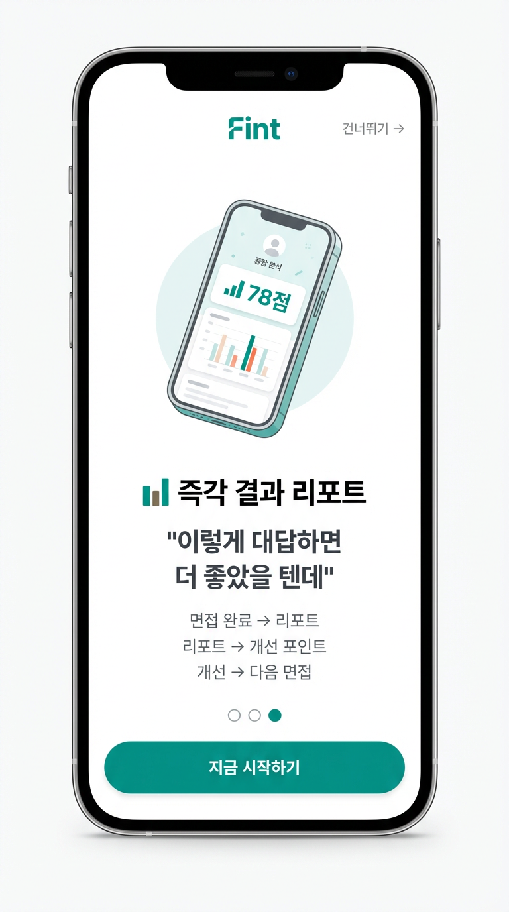

> 생성: 2026-03-22, Gemini 3.1 Flash Image Preview via OpenRouter

---

## 화면 1-2 [MVP]: 온보딩 — 프로필 설정 (취준생)

### 시나리오

로그인 없이 바로 진입한 이취준. "1단계만 하면 첫 면접을 시작할 수 있어요" 안내와 함께 직군 선택 + 취준 단계 선택이 1화면에서 통합 처리된다. 자소서 업로드는 Phase 1부터 제공. 완료 후 즉시 첫 면접 CTA가 표시된다.

### 목적

- AI 맞춤 질문 생성의 개인화 기반 마련
- 핵심 입력 1단계 원칙 준수: 직군 + 취준 단계를 1화면에서 동시 입력 → 즉시 면접 시작
- 마찰 최소화 — 로그인 없이 즉시 체험 진입

### 핵심 요소

- 직군 + 취준 단계 **1화면 통합** (스크롤 1페이지)
- 직군 선택 (최대 3개, 인기 직군 상단 고정)
- 취준 단계 선택 (서류 준비 / 면접 준비 / 최종합격 대기)
- 자소서 업로드 (선택, 스킵 버튼 제공, 업로드 시 혜택 강조)
- 첫 면접 시작 CTA

---

#### 단계 1/1 — 직군 + 취준 단계 통합 (MVP — 1화면)

```
┌─────────────────────┐
│ ←   프로필 설정     │
├─────────────────────┤
│                     │
│   어떤 직군을       │
│   준비 중인가요?    │
│   최대 3개 선택     │
│                     │
│ ┌─────┐ ┌─────┐ ┌──┐│
│ │ IT  │ │마케팅│ │PM││  ← 인기 직군 (선택 시 Teal 강조)
│ └─────┘ └─────┘ └──┘│
│ ┌─────┐ ┌─────┐ ┌──┐│
│ │금융 │ │컨설팅│ │HR││
│ └─────┘ └─────┘ └──┘│
│ ┌─────┐ ┌─────┐ ┌──┐│
│ │디자인│ │영업 │ │+더││
│ └─────┘ └─────┘ └──┘│
│                     │
│ ─────────────────── │  ← 구분선
│                     │
│   지금 어느 단계에  │
│   있나요?           │
│                     │
│ ○ 📄 서류 준비 중  │
│ ● 🎤 면접 준비 중  │  ← 선택됨 (Teal 강조)
│ ○ 🏆 최종합격 대기 │
│                     │
│ ┌───────────────────┐│
│ │    면접 시작하기  ││  ← Primary 버튼 (둘 다 선택 시 활성화)
│ └───────────────────┘│
└─────────────────────┘
```

---

#### 단계 3/3 — 자소서 업로드 (선택, ⚠️ Phase 1부터 제공 — MVP 미포함)

```
┌─────────────────────┐
│ ←   프로필 설정     │
│ ██████████  3 / 3   │  ← 진행 바 완료
├─────────────────────┤
│                     │
│   자소서를 올리면   │
│   맞춤 질문이       │
│   생성돼요!         │
│                     │
│ ┌─────────────────┐ │
│ │                 │ │
│ │   📎 자소서      │ │  ← 업로드 영역 (점선 테두리)
│ │   업로드         │ │
│ │   PDF·HWP·DOC   │ │
│ │   최대 10MB     │ │
│ │                 │ │
│ │ [파일 선택하기] │ │
│ └─────────────────┘ │
│                     │
│ 💡 업로드하면       │
│   • 직무 맞춤 질문  │
│   • 자소서 기반 꼬  │
│     리질문 생성     │
│                     │
├─────────────────────┤
│                     │
│ ┌───────────────────┐│
│ │  🎤 첫 면접 시작! ││  ← Primary CTA (업로드 여부 무관 활성화)
│ └───────────────────┘│
│                     │
│   나중에 올릴게요   │  ← 스킵 링크 (소문자, 회색)
│                     │
└─────────────────────┘
```

### 시안 이미지

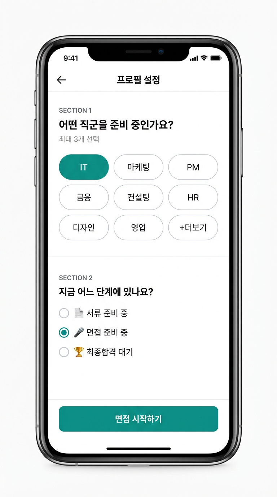

> 생성: 2026-03-22, Gemini 3.1 Flash Image Preview via OpenRouter

---

## 화면 2 [Phase 2+]: 홈 피드

### 시나리오

로그인 직후 첫 화면. 취준생·현직자·AI 페르소나의 게시물이 뒤섞여 있다. AI 게시물에는 🤖 배지가 자동 표시되어 누구나 한눈에 확인할 수 있다. 상단에는 크레딧 잔액과 오늘의 스트릭이 노출된다. **이 화면은 Phase 2+3 기능 (개발 레퍼런스용) — MVP에서는 홈 피드 없음.**

### 목적

- 커뮤니티 활성감 제공 (AI + 실사용자 혼재)
- 크레딧 소비 동기 부여 (아차포인트 열람, 면접 운세)
- 면접 시작 CTA 자연스럽게 노출

### 핵심 요소

- 상단 바: 로고, 크레딧 잔액, 알림 아이콘
- 스트릭 위젯 (7일 캘린더)
- 피드 카드: 익명 프로필, 게시글 요약, 좋아요/댓글 수
- 🤖 AI 배지 자동 표시 (크레딧 불필요, 디폴트 오픈)
- 오늘의 면접 운세 배너 (크레딧 소비)

---

```
┌─────────────────────┐
│ Fint     🪙45   🔔  │  ← 상단 바 (크레딧잔액 + 알림)
├─────────────────────┤
│ 🔥 3일 연속 면접 중 │  ← 스트릭 위젯
│ ✅ ✅ ✅ ○ ○ ○ ○    │  ← 월 화 수 목 금 토 일
├─────────────────────┤
│ 오늘의 추천 ✨       │
├─────────────────────┤
│                     │
│ 🧑 취준생_익명324   │  ← 익명 프로필
│ 오늘 카카오 서류 합 │
│ 격했어요! 면접 준비  │
│ 어떻게 시작해야 할  │
│ 까요? 아무것도 모르 │
│ 겠어요 😭           │
│                     │
│ 💬 12   ❤️ 34   [확인]│
│                     │
├─────────────────────┤
│                     │
│ 🤖 AI_페르소나_003  │  ← AI 배지 자동 표시
│ 대기업 면접에서 가  │
│ 장 중요한 건 결국   │
│ "스토리"예요. 직무  │
│ 경험을 이야기로 엮  │
│ 어보세요 💡         │
│                     │
│ 💬 8    ❤️ 67        │
│                     │
├─────────────────────┤
│                     │
│ 🔮 오늘의 면접 운세 │  ← 콘텐츠 배너
│ "당신의 합격 확률은?│
│  오늘의 운세로 확인"│
│ [🪙 N크레딧으로 확인 [미확정]] │
│                     │
├─────────────────────┤
│                     │
│ 🧑‍💼 최현직 (대기업) │  ← 현직자 게시글
│ 신입 면접에서 제일  │
│ 많이 보는 건 솔직히 │
│ 태도예요. 실력은    │
│ 2순위입니다         │
│                     │
│ 💬 45   ❤️ 123       │
│ [쪽지 보내기 🪙 N [미확정]] │  ← 크레딧으로 쪽지
│                     │
└─────────────────────┘
```

---

## 화면 3 [MVP]: 채팅형 모의면접

### 시나리오

이취준이 기본 제공 AI 면접관 중 "HR 김지수"를 선택하고 모의면접을 시작한다. 카카오톡처럼 친숙한 채팅 UI에서 AI 면접관이 질문을 던진다. 유저는 텍스트 또는 음성으로 답변한다. 면접 진행도를 상단 게이지로 확인할 수 있다. **MVP에서는 기본 AI 면접관 3종 제공 — 페르소나 마켓은 Phase 2+3 기능.**

### 목적

- 카카오톡 수준의 친숙한 UI로 면접 진입 장벽 제거
- 텍스트 입력 지원 (음성 입력은 Phase 1)
- 면접 진행률 시각화 (Q1 시작 시 "1/5" 표시 — displayIndex = min(questionIndex+1, total))
- 면접 진행률 시각화로 완료 동기 부여

### 핵심 요소

- 상단 바: 뒤로가기(← 탭 시 확인 팝업), 면접관 이름/상태, 진행도
  - **뒤로가기 정책 (MVP 확정)**: 확인 팝업 표시 — "면접을 중단할까요? 진행 내용은 저장되지 않습니다" [중단하기 / 계속하기]
- AI 메시지 버블 (왼쪽, #F9FAFB 배경, 회색 border)
- 유저 메시지 버블 (오른쪽, #0D9488 Teal 배경, 흰 텍스트)
- 하단 입력창 + 전송 버튼 (음성 버튼은 Phase 1)
- 타임스탬프

---

```
┌─────────────────────┐
│ ←   HR 김지수       │  ← 뒤로가기 + 면접관 이름
│     ● 면접 진행 중  │  ← 온라인 상태 표시
│ ████████░░░  4/5    │  ← 진행도 게이지 (MVP: 5문항, Q1시작="1/5")
├─────────────────────┤
│ ─────────────────── │
│ 🎙️ AI 면접이 시작됐어요! │  ← 시스템 배너 (상단 고정)
│ ─────────────────── │
│                     │
│  ┌──────────────┐   │
│  │ 🤖           │   │  ← AI 메시지 (왼쪽, #F9FAFB)
│  │ 안녕하세요!  │   │
│  │ 오늘 면접   │   │
│  │ 준비 됐나요? │   │
│  │ 😊          │   │
│  └──────────────┘   │
│  14:32              │
│                     │
│  ┌──────────────┐   │
│  │ 🤖           │   │
│  │ 자기소개를   │   │
│  │ 1분 안에 해  │   │
│  │ 주시겠어요?  │   │
│  └──────────────┘   │
│  14:32              │
│                     │
│           ┌───────┐ │
│           │ 네, 저│ │  ← 유저 답변 (오른쪽, #0D9488)
│           │는 OOO │ │  ← 흰 텍스트
│           │입니다.│ │
│           │저의 강│ │
│           │점은...│ │
│           └───────┘ │
│                14:33│
│                     │
│  ┌──────────────┐   │
│  │ 🤖           │   │
│  │ 잘 말씀하셨  │   │
│  │ 어요 😊 그렇 │   │
│  │ 다면 지원   │   │
│  │ 동기는요?    │   │
│  └──────────────┘   │
│  14:34              │
│                     │
├─────────────────────┤
│ ┌─────────────────┐ │
│ │  답변을 입력하세요│ │  ← 입력창
│ └─────────────────┘ │
│ [전송 ▶]            │  ← [Phase 1: 음성 입력] 음성 버튼 MVP 미포함
└─────────────────────┘
```

### 시안 이미지

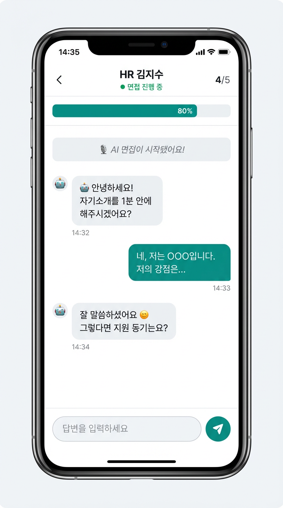

> 생성: 2026-03-22, Gemini 3.1 Flash Image Preview via OpenRouter

---

## 화면 4 [MVP]: 결과 리포트 + 합격 예언 오브

### 시나리오

5개 질문 답변 완료 (MVP 기준). 화면이 전환되며 결과 리포트가 등장한다 (Aha Moment). 종합 점수, 카테고리별 세부 점수, 실행 가능한 피드백을 확인한다. 하단에는 "합격 예언 오브" 예고 카드가 있어 Phase 1 후반 오픈 예정임을 안내한다. **MVP에서는 크레딧·결제 없음** — 오브는 잠금 상태로만 노출.

### 목적

- 면접 완료의 성취감 극대화 (Aha Moment)
- 합격 예언 오브 예고로 기대감 형성 (Phase 1 후반 오픈 예정)
- 재시도 유도 CTA

### 핵심 요소

- 종합 점수 진행 바
- 카테고리별 점수 표 (논리력, 표현력, 자신감)
- 실행형 피드백 (잘한 점 / 개선점)
- 합격 예언 오브 예고 카드 (MVP: "곧 열려요" 배너, Phase 1 후반: 크레딧 소비 CTA)
- 재시도 / 홈으로 버튼
- 낮은 점수 색상: `amber` 사용 (덜 위협적인 UX, `red` 미사용)

---

```
┌─────────────────────┐
│ 면접 결과 리포트 📊 │
│ HR 김지수 · 오늘    │
├─────────────────────┤
│                     │
│ 종합 점수           │
│ ████████░░   78점   │  ← 진행 바 (Primary 컬러)
│                     │
│ ┌──────┬──────┬─────┐│
│ │논리력│표현력│자신감││
│ │  82  │  74  │  80 ││
│ └──────┴──────┴─────┘│
│                     │
├─────────────────────┤
│ 실행형 피드백       │
│                     │
│ ✅ 잘 하셨어요      │
│  • 구체적 수치 사용 │
│    ("3개월간 +23%") │
│  • 논리적 흐름 명확 │
│                     │
│ 🔧 이렇게 해보세요  │
│  • 스토리를 STAR로  │
│    구조화하면 더 좋아│
│    요 (Situation →  │
│    Task → Action →  │
│    Result)          │
│  ▶ 개선 예시 보기   │  ← 예시 열기 (무료)
│                     │
├─────────────────────┤
│ 🔮 합격 예언 오브   │  ← Phase 1 후반 오픈 예정
│ ┌─────────────────┐ │
│ │  ╔═══════════╗  │ │
│ │  ║  🔮 잠김  ║  │ │  ← 블러 처리 + 자물쇠
│ │  ╚═══════════╝  │ │
│ │ 당신의 합격 가능 │ │
│ │ 성을 분석했어요  │ │
│ │  🔜 곧 열려요   │ │  ← MVP: 예고 배너 (크레딧 CTA 없음)
│ └─────────────────┘ │
├─────────────────────┤
│                     │
│ [다시 연습하기]     │  ← 재시도 CTA
│ [홈으로]            │  ← MVP: 결과 화면 이탈 즉시 소실
└─────────────────────┘
```

### 시안 이미지

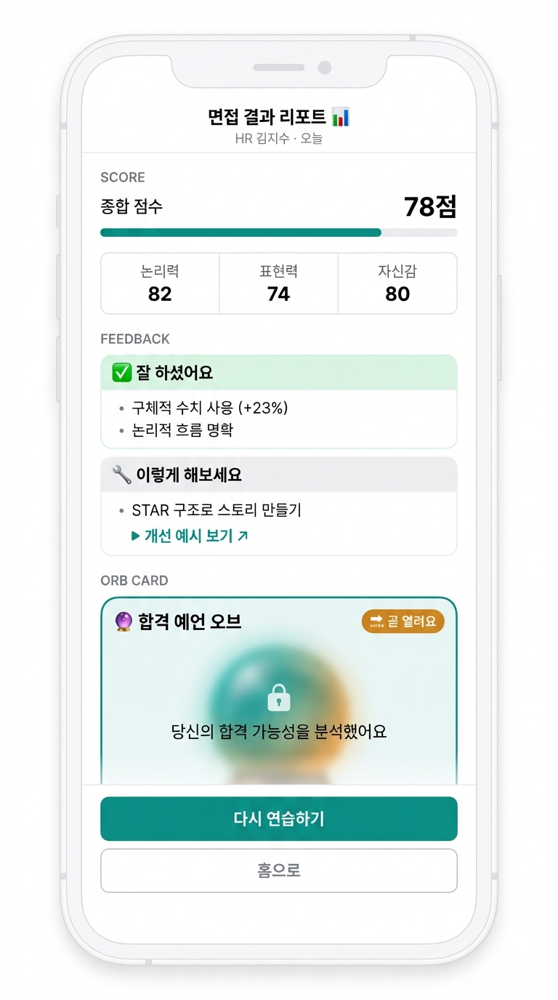

> 생성: 2026-03-22, Gemini 3.1 Flash Image Preview via OpenRouter

---

## 화면 [Phase 1 완료]: 로그인 — 소셜 + 이메일

> **구현 완료**: 이슈 #179, 2026-03-21

### 시나리오

비로그인으로 면접을 완료한 이취준. "결과를 저장하려면 로그인하세요" 배너(SaveAccountCTA)를 보고 로그인 화면으로 진입한다. 카카오/구글 소셜 로그인 또는 이메일 가입·로그인 중 선택한다. **익명 우선 원칙**: 미들웨어에서 비로그인 사용자를 /login으로 리다이렉트하지 않는다.

### 핵심 요소

- 소셜 로그인 버튼: 카카오 (노란색), 구글 (흰색)
- 이메일 탭: 가입 / 로그인 전환
- 익명→인증 마이그레이션: `migrate_anon_to_user` RPC (원자적 트랜잭션)
- 라우트: `/login`

```
┌─────────────────────┐
│ ←   로그인          │
├─────────────────────┤
│                     │
│     Fint            │  ← 로고
│                     │
│ ┌───────────────────┐│
│ │  🟡 카카오로 시작 ││  ← 카카오 버튼
│ └───────────────────┘│
│ ┌───────────────────┐│
│ │  🔵 구글로 시작   ││  ← 구글 버튼
│ └───────────────────┘│
│                     │
│ ─── 또는 이메일 ─── │
│                     │
│ [이메일 입력]       │
│ [비밀번호 입력]     │
│                     │
│ ┌───────────────────┐│
│ │      로그인       ││
│ └───────────────────┘│
│                     │
│    계정이 없으신가요? 가입하기 │
└─────────────────────┘
```

---

## 화면 [Phase 1 완료]: 면접 히스토리

> **구현 완료**: 이슈 #179, 2026-03-21

### 시나리오

하단 탭 "면접"을 누르면 과거 면접 세션 목록이 나타난다. Server Component로 Supabase DB를 직접 쿼리한다. 로그인 사용자는 본인 세션, 비로그인은 anonymous_id 기반 세션을 볼 수 있다.

### 핵심 요소

- 면접 히스토리 카드: 직군, 날짜, 총점
- 빈 상태(EmptyState): 면접 시작 CTA
- 라우트: `/interview`

---

## 화면 [Phase 1 완료]: 자소서 업로드

> **구현 완료**: 이슈 #179, 2026-03-21

### 시나리오

"면접 준비" 탭에서 자소서를 업로드하면 AI가 예상 질문을 생성한다. PDF 업로드 후 질문 목록을 받는다.

### 핵심 요소

- PDF 업로드 영역 (drag & drop)
- 예상 질문 목록 (업로드 완료 후)
- 라우트: `/resume`
- **주의**: 루트 div에 `w-full` 필수 (body flex center 때문에 거터 방지)

---

## 화면 4-1 [Phase 1]: 로그인 / 가입 화면 (소셜 + 이메일)

### 시나리오

이취준이 결과 확인 후 로그인을 시도한다. 로그인 화면이 나타난다. 상단에 탭이 있어 소셜 로그인과 이메일 로그인 중 선택할 수 있다. 이메일 탭을 선택하면 이메일·비밀번호 입력 폼과 가입 버튼이 표시된다.

### 목적

- 소셜 로그인 외 이메일 가입 경로 제공
- 탭 전환으로 두 가지 인증 방식을 단일 화면에 통합
- 비밀번호 분실 복구 경로 명시

### 핵심 요소

- 소셜 로그인 탭 (카카오·구글 버튼)
- 이메일 탭 (이메일·비밀번호 입력 폼, 가입하기 링크, 비밀번호 찾기 링크)
- 가입 화면 (이메일·비밀번호·비밀번호 확인 입력, 인증 메일 안내)
- 인증 메일 발송 완료 화면 (재발송 버튼)

---

#### 로그인 화면 — 이메일 탭 선택 시

```
┌─────────────────────────────┐
│  로그인 / 가입               │
│                             │
│  [소셜 로그인] [이메일]  ← 탭 │
│  ─────────────────────────  │
│                             │
│  [이메일 탭 선택 시]          │
│  이메일 ___________________  │
│  비밀번호 _________________  │
│                             │
│  [로그인]                    │
│  [이메일로 가입하기]           │
│                             │
│  비밀번호를 잊으셨나요?         │
└─────────────────────────────┘
```

---

#### 이메일 가입 화면

```
┌─────────────────────────────┐
│  이메일로 가입                │
│                             │
│  이메일 ___________________  │
│  비밀번호 _________________  │
│  비밀번호 확인 _____________  │
│                             │
│  [가입하기]                  │
│                             │
│  ✉️ 가입 후 인증 메일이 발송됩니다 │
└─────────────────────────────┘
```

---

#### 인증 메일 발송 완료 화면

```
┌─────────────────────────────┐
│  📧 메일을 확인해주세요        │
│                             │
│  {email}로 인증 링크를        │
│  발송했습니다                 │
│                             │
│  [인증 메일 재발송]           │
│  [다른 이메일로 가입]          │
└─────────────────────────────┘
```

---

## 화면 5 [Phase 2+]: 페르소나 마켓

### 시나리오

이취준이 하단 탭에서 "마켓"을 누른다. 회사별·직군별로 다양한 AI 면접관 페르소나가 나열되어 있다. 크레딧 잔액을 확인하고 원하는 현직자 기반 AI 면접관을 선택해 면접을 시작한다. 인기 급상승 페르소나와 한정 등록 페르소나는 별도 배지로 강조된다.

### 목적

- 크레딧 소비 핵심 경로
- 회사·직군 다양성으로 재방문 유도
- 한정 페르소나로 희소성 자극

### 핵심 요소

- 크레딧 잔액 표시
- 직군 필터 탭 (전체 / IT / 금융 / 마케팅 / 컨설팅)
- 페르소나 카드: 회사·직책, 별점, 면접 진행 횟수, 크레딧 CTA
- 인기 급상승 / 한정 등록 배지

---

```
┌─────────────────────┐
│ 🧑‍💼 페르소나 마켓   │
│ 🪙 잔액: 55크레딧     │
├─────────────────────┤
│ [전체] [IT] [금융]  │
│ [마케팅] [컨설팅]   │  ← 가로 스크롤 필터 탭
├─────────────────────┤
│                     │
│ ┌─────────────────┐ │
│ │ 🌟 인기 급상승  │ │  ← 배지
│ │ ┌────┐          │ │
│ │ │ 👤 │삼성전자  │ │  ← 아바타 (64px 원형)
│ │ └────┘개발팀장  │ │
│ │ ★★★★★ (4.9)   │ │
│ │ 면접 진행 523회  │ │
│ │ [🪙 N크레딧으로 면접 [미확정]]│ │  ← CTA
│ └─────────────────┘ │
│                     │
│ ┌─────────────────┐ │
│ │                 │ │
│ │ ┌────┐          │ │
│ │ │ 👤 │카카오    │ │
│ │ └────┘PM 5년차  │ │
│ │ ★★★★☆ (4.6)   │ │
│ │ 면접 진행 287회  │ │
│ │ [🪙 N크레딧으로 면접 [미확정]]│ │
│ └─────────────────┘ │
│                     │
│ ┌─────────────────┐ │
│ │ 🔥 한정 등록    │ │  ← 한정 배지
│ │ ┌────┐          │ │
│ │ │ 👤 │외국계    │ │
│ │ └────┘컨설팅    │ │
│ │      시니어 매니저│ │
│ │ ★★★★★ (5.0)   │ │
│ │ 면접 진행 91회   │ │
│ │ [🪙 N크레딧으로 면접 [미확정]]│ │  ← 희소성 프리미엄
│ └─────────────────┘ │
│                     │
│ ┌─────────────────┐ │
│ │ ┌────┐          │ │
│ │ │ 👤 │네이버    │ │
│ │ └────┘UX 리서처 │ │
│ │ ★★★★☆ (4.7)   │ │
│ │ 면접 진행 156회  │ │
│ │ [🪙 N크레딧으로 면접 [미확정]]│ │
│ └─────────────────┘ │
│                     │
└─────────────────────┘
```

---

## 화면 6 [Phase 2+]: 크레딧 소비 콘텐츠 — 면접관 아차포인트

### 시나리오

홈 피드에서 "삼성전자 개발팀장 아차포인트" 콘텐츠를 발견한 이취준. 일부 항목은 무료로 공개되어 있고, 핵심 탈락 원인은 잠겨 있다. 크레딧을 소비해 잠금을 해제하면 "면접관이 즉시 탈락을 결정했던 실제 패턴"을 확인할 수 있다.

### 목적

- 크레딧 소비 핵심 콘텐츠
- 희소 정보 기반 크레딧 가치 체감
- 무료 미리보기로 소비 욕구 자극

### 핵심 요소

- 무료 공개 항목 (2~3개)
- 잠금 카드 (블러 + 크레딧 CTA)
- 이미 열람한 항목 목록

---

```
┌─────────────────────┐
│ ← 💡 면접관 아차포인트│
├─────────────────────┤
│ 삼성전자 개발직군   │
│ 전 면접관 직접 작성 │
│ ★★★★★ 열람 1,247회│
├─────────────────────┤
│                     │
│ ✅ 무료 공개 항목   │
│                     │
│ 1. 답변이 3분을 넘  │
│    으면 집중력이 즉  │
│    시 떨어집니다     │
│                     │
│ 2. 구체적 수치 없는 │
│    성과 설명은 신뢰  │
│    도가 절반 이하로  │
│    낮아집니다        │
│                     │
├─────────────────────┤
│                     │
│ 🔒 잠긴 핵심 항목   │
│                     │
│ ┌─────────────────┐ │
│ │ ▒▒▒▒▒▒▒▒▒▒▒▒▒   │ │  ← 블러 처리
│ │ "이 행동을 하면  │ │
│ │  바로 탈락 결정  │ │
│ │  했습니다. 실제  │ │
│ │  면접에서 ▒▒▒▒  │ │
│ │  ▒▒▒▒▒▒▒▒..."  │ │
│ │                 │ │
│ │ [🪙 N크레딧으로 열기 [미확정]]│ │
│ └─────────────────┘ │
│                     │
│ ┌─────────────────┐ │
│ │ ▒▒▒▒▒▒▒▒▒▒▒▒▒   │ │
│ │ "질문에 모른다고 │ │
│ │  했을 때 면접관  │ │
│ │  의 반응은 사실  │ │
│ │  ▒▒▒▒▒▒▒▒..."  │ │
│ │                 │ │
│ │ [🪙 N크레딧으로 열기 [미확정]]│ │
│ └─────────────────┘ │
│                     │
└─────────────────────┘
```

---

## 화면 7 [Phase 1]: 현직자 쪽지 발송

### 시나리오

이취준이 홈 피드에서 대기업 마케팅 현직자 최현직의 글에 감명 받아 "쪽지 보내기" 버튼을 누른다. 쪽지 작성 화면에서 메시지를 입력하고 크레딧 발송 확인 후 전송한다. 발송 완료 시 성공 토스트가 표시되고, 최현직의 응답을 기다린다.

### 목적

- 크레딧 소비 핵심 경로 (취준생 → 현직자)
- 현직자 네트워킹 가치 체감
- 크레딧 발송 전 확인 UX로 실수 방지

### 핵심 요소

- 현직자 프로필 카드 (회사, 직급, 응답률)
- 메시지 입력창 (최대 300자)
- 크레딧 발송 비용 표시 + 잔액 차감 예고
- 취소 / 발송 버튼

---

```
┌─────────────────────┐
│ ←  쪽지 보내기      │
├─────────────────────┤
│                     │
│ ┌─────────────────┐ │
│ │  ┌────┐         │ │
│ │  │ 👤 │최현직   │ │  ← 현직자 프로필
│ │  └────┘대기업   │ │
│ │       마케팅    │ │
│ │       시니어    │ │
│ │ ★★★★☆ 응답률 84%│ │
│ └─────────────────┘ │
│                     │
│ 메시지 (최대 300자) │
│                     │
│ ┌─────────────────┐ │
│ │ 안녕하세요! 카카 │ │  ← 입력창 (기본 문구 제안)
│ │ 오 개발 직군 면  │ │
│ │ 접을 준비 중인  │ │
│ │ 취준생입니다.   │ │
│ │ 혹시 면접 준비  │ │
│ │ 관련해서 짧은   │ │
│ │ 조언 부탁드려도 │ │
│ │ 될까요? 🙏      │ │
│ └─────────────────┘ │
│                 89/300│  ← 글자 수 카운터
│                     │
├─────────────────────┤
│ 발송 비용           │
│ 🪙 N크레딧 [미확정]   │
│ 현재 잔액: 55크레딧   │
│ 발송 후 잔액: (55-N)크레딧 [미확정]│
├─────────────────────┤
│                     │
│ [취소]  [🪙 N크레딧으로 발송 [미확정]]│
│                     │
└─────────────────────┘
```

---

## 화면 8 [Phase 2+]: 크레딧 충전 / 획득 방법 안내

### 시나리오

이취준의 크레딧이 부족해진다. 하단에 "크레딧이 5개밖에 안 남았어요" 토스트가 표시되고, 크레딧 아이콘을 탭하면 충전/획득 방법 안내 화면으로 이동한다.

### 목적

- 크레딧 부족 시 이탈 방지
- 무료 획득 경로 강조 → 면접 참여 유도
- 유료 충전 경로도 제공

### 핵심 요소

- 현재 잔액
- 무료 획득 방법 리스트
- 유료 충전 패키지

---

```
┌─────────────────────┐
│ ←  🪙 크레딧 충전     │
│ 현재 잔액: 5크레딧    │
├─────────────────────┤
│ 무료로 크레딧 모으기  │
│                     │
│ ┌─────────────────┐ │
│ │ 🎤 모의면접 완료 │ │
│ │ 1회당 🪙 +N [미확정] │ │
│ │ [지금 면접하기→] │ │
│ └─────────────────┘ │
│                     │
│ ┌─────────────────┐ │
│ │ 📝 피드 게시글  │ │
│ │ 1회당 🪙 +N [미확정] │ │
│ │ [글 쓰러 가기→] │ │
│ └─────────────────┘ │
│                     │
│ ┌─────────────────┐ │
│ │ 🔥 7일 연속 출석│ │
│ │ 완료 시 🪙 +N [미확정] │ │
│ │ 오늘 출석 완료  │ │
│ └─────────────────┘ │
│                     │
├─────────────────────┤
│ 크레딧 패키지 구매    │
│                     │
│ ┌──────────────────┐ │
│ │ 기본 / 인기 / 추천│ │
│ │ 패키지 구성·가격  │ │
│ │ 미확정 [미확정]  │ │
│ └──────────────────┘ │
│                     │
└─────────────────────┘
```

---

## 화면 9 [Phase 1]: 현직자 온보딩

### 시나리오

대기업 마케터 최현직이 "현직자로 가입"을 누른다. 역할 선택 → 소셜 로그인 → 회사 이메일 인증 → 페르소나 제작(AI 도우미 안내) → 첫 등록 완료 보상 순서로 20분 이내에 완료한다.

### 목적

- 현직자(공급자) 획득 및 온보딩
- 페르소나 제작 장벽 최소화
- 재직 인증으로 신뢰도 확보

### 핵심 요소

- 취준생 vs 현직자 역할 선택 화면
- 회사 이메일 인증 (즉시) / 재직증명서 업로드 (3영업일)
- 페르소나 제작 마법사 (5단계)
- 첫 등록 완료 보상 화면

---

#### 역할 선택 화면

```
┌─────────────────────┐
│       Fint          │
├─────────────────────┤
│                     │
│   어떻게 활동하실   │
│   건가요?           │
│                     │
│ ┌─────────────────┐ │
│ │  🎯 취업 준비   │ │  ← 취준생 선택
│ │                 │ │
│ │  면접 연습하고  │ │
│ │  현직자 조언    │ │
│ │  받기           │ │
│ └─────────────────┘ │
│                     │
│ ┌─────────────────┐ │
│ │ 🧑‍💼 현직자 멘토 │ │  ← 현직자 선택 (강조)
│ │                 │ │
│ │  내 경험을 나눠 │ │
│ │  후배에게 도움  │ │
│ │  주기           │ │
│ └─────────────────┘ │
│                     │
└─────────────────────┘
```

---

#### 재직 인증 화면

```
┌─────────────────────┐
│ ← 재직 인증         │
│ ██████░░░░  2 / 5   │  ← 진행 바
├─────────────────────┤
│                     │
│ 🔒 현직자 인증이    │
│    필요해요         │
│                     │
│ 인증 방법 선택:     │
│                     │
│ ┌─────────────────┐ │
│ │ ✉️ 회사 이메일  │ │  ← 추천 (즉시)
│ │  @company.com   │ │
│ │  즉시 인증 가능  │ │
│ └─────────────────┘ │
│                     │
│ ┌─────────────────┐ │
│ │ 📋 재직증명서   │ │  ← 선택지 2 (3영업일)
│ │  업로드          │ │
│ │  3영업일 내 검토│ │
│ └─────────────────┘ │
│                     │
│ 🔒 닉네임은 익명으  │
│    로 유지됩니다    │
│                     │
└─────────────────────┘
```

---

#### 페르소나 마법사 — 단계 3/5: 직군·연차 입력

```
┌─────────────────────┐
│ ← 페르소나 제작     │
│ ██████░░░░  3 / 5   │  ← 진행 바
├─────────────────────┤
│                     │
│   어떤 분야에서     │
│   일하고 계세요?    │
│                     │
│ 직군 선택           │
│ ┌─────┐ ┌─────┐ ┌──┐│
│ │마케팅│ │ IT  │ │PM││
│ └─────┘ └─────┘ └──┘│
│ ┌─────┐ ┌─────┐ ┌──┐│
│ │금융 │ │컨설팅│ │+더││
│ └─────┘ └─────┘ └──┘│
│                     │
│ 연차                │
│ ┌─────────────────┐ │
│ │  1~3년차  ▼     │ │  ← 드롭다운
│ └─────────────────┘ │
│                     │
│ ┌───────────────────┐│
│ │      다음 →       ││
│ └───────────────────┘│
└─────────────────────┘
```

---

#### 페르소나 마법사 — 단계 4/5: 면접 스타일 설정

```
┌─────────────────────┐
│ ← 페르소나 제작     │
│ ████████░░  4 / 5   │
├─────────────────────┤
│                     │
│   면접 스타일을     │
│   골라주세요        │
│                     │
│ ┌─────────────────┐ │
│ │ 😊 친근한 HR형  │ │  ← 선택됨 (Teal 테두리)
│ │  따뜻하게 대화  │ │
│ │  하는 스타일    │ │
│ └─────────────────┘ │
│                     │
│ ┌─────────────────┐ │
│ │ 🔍 날카로운 실무│ │
│ │  형 논리·수치   │ │
│ │  집중           │ │
│ └─────────────────┘ │
│                     │
│ ┌─────────────────┐ │
│ │ 🧑‍💼 정중한 임원형│ │
│ │  격식체·경청    │ │
│ │  중심           │ │
│ └─────────────────┘ │
│                     │
│ ┌───────────────────┐│
│ │      다음 →       ││
│ └───────────────────┘│
└─────────────────────┘
```

---

#### 페르소나 마법사 — 단계 5/5: 대표 질문 3개 입력

```
┌─────────────────────┐
│ ← 페르소나 제작     │
│ ██████████  5 / 5   │
├─────────────────────┤
│                     │
│   내가 꼭 묻는      │
│   질문을 알려주세요 │
│   (최소 1개)        │
│                     │
│ ┌─────────────────┐ │
│ │ Q1. 본인의 가장 │ │  ← 입력 완료
│ │     큰 실패 경험 │ │
│ │     은?         │ │
│ └─────────────────┘ │
│                     │
│ ┌─────────────────┐ │
│ │ Q2. 입력하세요  │ │  ← 입력 중 (커서)
│ │     |           │ │
│ └─────────────────┘ │
│                     │
│ ┌─────────────────┐ │
│ │ Q3. 입력하세요  │ │  ← 선택 (빈칸 가능)
│ └─────────────────┘ │
│                     │
│ 💡 AI가 이 질문을   │
│    바탕으로 면접을  │
│    진행해요         │
│                     │
│ ┌───────────────────┐│
│ │   페르소나 등록!  ││  ← Primary 버튼
│ └───────────────────┘│
└─────────────────────┘
```

---

#### 첫 페르소나 등록 완료 화면

```
┌─────────────────────┐
│                     │
│        🎉           │
│                     │
│  페르소나 등록      │
│  완료!              │
│                     │
│ ┌─────────────────┐ │
│ │  👤 마케터J     │ │  ← 내 페르소나 카드
│ │  마케팅 5년차   │ │
│ │  대기업 · 비공개│ │
│ └─────────────────┘ │
│                     │
│ 🪙 크레딧 N개 지급!   │  ← 보너스 [미확정]
│                     │
│ 취준생이 이 페르소  │
│ 나와 면접 완료 시   │
│ 크레딧 자동 적립      │
│ (배분율 70%)        │
│                     │
│ ┌───────────────────┐│
│ │    홈으로 이동    ││
│ └───────────────────┘│
└─────────────────────┘
```

---

## 화면 10 [Phase 2+]: 직무 MBTI 카드 (크레딧 소비)

### 시나리오

모의면접을 5회 이상 완료한 이취준. 홈 피드 배너에서 "내 직무 MBTI 카드 생성됐어요!" 알림을 받는다. 크레딧을 소비해 자신의 면접 성향을 4가지 축으로 분석한 카드를 열람하고, SNS에 공유하여 바이럴을 발생시킨다.

### 목적

- Phase 2 핵심 바이럴 콘텐츠
- 크레딧 소비 동기 부여 (재미 + 자기 이해)
- SNS 공유로 신규 유입 촉진

### 핵심 요소

- 4가지 축 성향 바 (분석/실행, 협력/독립, 기획/운영, 언어/수치)
- 직무 유형 이름 + 한줄 설명
- 추천 직군 리스트
- SNS 공유 버튼 + 상세 보고서 크레딧 소비

---

```
┌─────────────────────┐
│ 🧬 내 직무 MBTI     │
│ 면접 5회 이상 분석  │
├─────────────────────┤
│                     │
│   📊 면접 성향 분석 │
│                     │
│  분석력  ████████░░ 82% │
│  협력도  ██████░░░░ 60% │
│  기획력  █████████░ 91% │
│  언어력  ███████░░░ 74% │
│                     │
├─────────────────────┤
│                     │
│    🔖 전략형 기획가 │  ← 직무 유형명
│                     │
│  "논리와 데이터로   │
│   문제를 정의하고,  │
│   팀을 설득하는 사람"│
│                     │
│  추천 직군:         │
│  PM / 컨설팅 / 기획 │
│                     │
├─────────────────────┤
│ ┌───────────────────┐│
│ │  📤 카드 공유하기 ││  ← SNS 공유 (무료)
│ └───────────────────┘│
│ ┌───────────────────┐│
│ │ 🪙 N크레딧으로 상세 ││  ← 보고서 잠금 해제
│ │   보고서 보기     ││    [미확정]
│ └───────────────────┘│
└─────────────────────┘
```

### 공유 완료 UX 보강

- 공유 완료 Toast: "공유 완료! 친구가 볼 수 있어요" (1.5초)
- 딥링크 복귀: SNS에서 앱으로 복귀 시 카드 재표시
- "친구도 만들어보기" CTA 추가 (공유 완료 후 하단 표시)

---

## 화면 11 [MVP / Phase 1 / Phase 2+]: 빈 상태 / 에러 상태

### 시나리오

처음 설치한 유저, 네트워크 오류, 크레딧 부족 상황에서 앱이 멈추거나 텅 빈 상태가 되지 않도록 안내한다.

### 목적

- 이탈 방지 (빈 화면 대신 다음 행동 유도)
- 에러 발생 시 신뢰 유지 + 복구 경로 제공

---

#### 빈 홈 피드 [Phase 2+]

```
┌─────────────────────┐
│ Fint     🪙0    🔔  │
├─────────────────────┤
│                     │
│                     │
│    [🏜️ 텅 빈 일러스트]│
│                     │
│   아직 게시물이     │
│   없어요.           │
│   첫 면접을 완료하면│
│   피드가 채워져요!  │
│                     │
│ ┌───────────────────┐│
│ │  첫 면접 시작하기 ││  ← Primary CTA
│ └───────────────────┘│
│                     │
└─────────────────────┘
```

---

#### 빈 쪽지함 [Phase 1]

```
┌─────────────────────┐
│ ← 쪽지함            │
├─────────────────────┤
│                     │
│    [✉️ 빈 편지 일러스트]│
│                     │
│   아직 쪽지가 없어요│
│   현직자에게 첫     │
│   쪽지를 보내보세요!│
│                     │
│ ┌───────────────────┐│
│ │  현직자 찾아보기  ││
│ └───────────────────┘│
│                     │
└─────────────────────┘
```

---

#### 빈 면접 히스토리 [MVP]

```
┌─────────────────────┐
│ ← 면접 히스토리     │
├─────────────────────┤
│                     │
│    [📊 그래프 일러스트]│
│                     │
│   면접 기록이 없어요│
│   첫 면접을 완료하면│
│   여기에 결과가     │
│   저장됩니다!       │
│                     │
│ ┌───────────────────┐│
│ │   지금 면접 시작  ││
│ └───────────────────┘│
│                     │
└─────────────────────┘
```

---

#### 네트워크 오류 [MVP]

```
┌─────────────────────┐
│ Fint     🪙?    🔔  │
├─────────────────────┤
│                     │
│    [📡 오프라인 일러스트]│
│                     │
│   연결이 끊겼어요   │
│   인터넷 연결을     │
│   확인해주세요      │
│                     │
│ ┌───────────────────┐│
│ │    다시 시도하기  ││  ← 재시도 CTA
│ └───────────────────┘│
│                     │
└─────────────────────┘
```

---

#### 면접 중 AI 응답 오류 [MVP]

```
┌─────────────────────┐
│ ←   HR 김지수       │
│     ● 면접 진행 중  │
│ ████████░░░  4/5    │
├─────────────────────┤
│                     │
│  ┌──────────────┐   │
│  │ 🤖           │   │
│  │ 잠깐, 생각   │   │
│  │ 중이에요...  │   │
│  │ ⣾ (로딩 중) │   │
│  └──────────────┘   │
│                     │
│  ┌──────────────────┐│
│  │ ⚠️ 응답에 문제가  ││
│  │   생겼어요.       ││
│  │ [다시 보내기]    ││  ← 재시도
│  │ [면접 저장 후   ││
│  │    종료]         ││  ← 안전 종료
│  └──────────────────┘│
│                     │
└─────────────────────┘
```

---

#### 크레딧 부족 (소비 시도 모달) [Phase 2+]

```
┌─────────────────────┐
│  ╔═════════════╗    │
│  ║   🪙 부족   ║    │  ← 모달
│  ╠═════════════╣    │
│  ║             ║    │
│  ║ 크레딧이      ║    │
│  ║ 부족해요    ║    │
│  ║             ║    │
│  ║ 필요: N크레딧 ║    │
│  ║ 현재: M크레딧 ║    │
│  ╠═════════════╣    │
│  ║[면접하고    ║    │  ← 무료 획득 경로
│  ║ 크레딧 모으기]║    │
│  ║[크레딧 충전]  ║    │  ← 유료 충전
│  ║[취소]       ║    │
│  ╚═════════════╝    │
└─────────────────────┘
```

---

### 추가 빈 상태 카탈로그

| 화면 | 빈 상태 조건 | 표시 내용 |
|------|------------|---------|
| 페르소나 마켓 (화면 23) | 런칭 초기 현직자 없음 | "아직 현직자 페르소나가 없어요. AI 김지수로 연습해보기 →" |
| 커뮤니티 탭 (화면 24) | 게시물 없음 | "첫 후기를 작성해보세요! 🪙 크레딧도 받아요" |
| 알림 센터 (화면 26) | 알림 없음 | "아직 알림이 없어요. 면접을 완료하면 알림을 받을 수 있어요" |
| 프로필 탭 (화면 18) | 첫 방문 | "아직 면접 기록이 없어요. 첫 면접을 시작해보세요! →" |
| 레벨업/배지 (화면 15) | 배지 미달성 | "아직 배지가 없어요. 첫 면접을 시작해보세요! →" |

### 추가 에러 상태 카탈로그

| 화면 | 에러 조건 | 표시 내용 | 행동 |
|------|---------|---------|------|
| 결제 실패 (화면 25) | PG 오류 | "결제에 실패했어요" + 에러 코드별 메시지 | 재시도/취소 |
| 재직증명서 반려 (화면 27) | 서류 반려 | "서류가 반려됐어요. 재제출해주세요" | 재제출 CTA |
| 자소서 업로드 실패 (화면 L3) | 형식/용량 초과 | "지원되지 않는 형식이에요 (PDF/HWP만 가능)" | 재업로드 CTA |
| 쪽지 발송 실패 (화면 7) | 크레딧 차감 오류 | "크레딧 차감에 실패했어요. 발송이 취소됐어요" | 환급 안내 |
| 면접 세션 만료 (화면 3) | 장시간 미응답 | "면접 세션이 만료됐어요. 다시 시작해주세요" | 화면 12로 이동 |
| 결과 리포트 실패 (화면 4) | status: 'failed' | "결과를 생성하지 못했어요" | 재시도/홈 탭 |
| MBTI 카드 생성 실패 (화면 29) | 30초 타임아웃 | "카드를 만들지 못했어요" | 재시도/홈 탭 복귀 링크 |

---

## 화면 플로우 요약

```
[앱 설치]
    ↓
[스플래시 / 온보딩 슬라이드 3장]  ← MVP: 로그인 없이 즉시 진입
    ↓
[프로필 설정: 직군 선택 → 취준 단계]  ← 자소서 업로드는 Phase 1
    ↓
[채팅형 모의면접 (5문항)] → [결과 리포트 ★ Aha Moment]
    ↓
    ← **비로그인 결과 영속성 (MVP 확정)**: 결과 화면 이탈 즉시 소실. 저장 없음. 로컬 저장 없음.
    ← [Phase 1] 로그인 후 결과 저장 기능 추가 예정
    ↓
[홈 피드]
    │
    ├─ [취준생] → [프로필 설정: 직군 선택 → 취준 단계 → 자소서 업로드(선택)] → [홈 피드]
    │     ├─→ [페르소나 마켓] → [채팅형 모의면접] → [결과 리포트]
    │     │                                              ↓
    │     │                              [합격 예언 오브 🔒] (크레딧 소비)
    │     │                              [직무 MBTI 카드 🔒] (크레딧 소비, Phase 2)
    │     ├─→ [아차포인트 콘텐츠 🔒] (크레딧 소비)
    │     ├─→ [현직자 프로필] → [쪽지 발송 🪙]
    │     └─→ [크레딧 충전 / 획득 안내]
    │
    └─ [현직자] → [재직 인증] → [페르소나 제작] → [첫 페르소나 완료 🎉]
                                                         ↓
                                             [현직자 크레딧 소비처]
                                             (연봉 통계 / 이직 타이밍 / 스카우트 후기)
```

**빈 상태 / 에러 상태**: 빈 피드 · 빈 쪽지함 · 빈 면접 히스토리 · 네트워크 오류 · AI 응답 오류 · 크레딧 부족 모달

### Phase 1 핵심 플로우

**면접 준비 플로우**:
화면 12(설정) → 화면 13(면접관 선택) → 화면 3(채팅면접) → 화면 4(결과) → 화면 19(Aha Moment)

**크레딧 부족 플로우**:
화면 20(게이트) → [무료 채우기] 화면 12 → 면접 완료 → 크레딧 적립
화면 20(게이트) → [충전하기] 화면 25 → 결제 성공 → returnTo 복귀
화면 20(게이트) → [결제 실패] → 화면 20 재진입 (currentCredits 서버 재조회)

**커뮤니티 플로우**:
화면 17(후기 작성) → [커뮤니티 보기] 화면 24
화면 17(후기 작성) → [취소] 화면 4(결과) 복귀

**현직자 전환 플로우**:
화면 18(프로필) → 화면 30(전환 모달) → 화면 9(현직자 온보딩, Phase 1) / 화면 27(현직자 온보딩 보강, Phase 2) → 화면 23(페르소나 마켓 등록)
화면 18(프로필) → 화면 30(전환 모달) → [취소] → 화면 18 복귀

---

*작성일: 2026-03-16 | 버전: v0.2 | 작성: Fint 기획팀*

---

## Phase 2 화면 상세 명세

### 4-1. Aha Moment (결과 리포트 — 첫 면접 완료)

> 🔗 이 명세는 화면 19 (Aha Moment + 스트릭 달성)에 통합됨. 상세 규칙은 화면 19 참조.

**트리거**: 첫 번째 면접 완료 직후

**화면 요소**:
- 감정 레이어 우선: 카운트업 전 0.5초간 "첫 면접 완료!" 헤드라인 + Teal 풀스크린 플래시 (불안 완화 후 점수 공개)
- 총점 대형 표시 (애니메이션 카운트업, 감정 레이어 후 등장)
- 카테고리별 점수 바 — **내림차순 정렬** (높은 항목 → 낮은 항목): 논리력/자기표현/직무적합도/의사소통
- 낮은 점수 항목: 수치 대신 "성장 여지 있음" 마이크로카피 레이블
- "잘 하셨어요!" 실행형 피드백 3줄
- 크레딧 획득 애니메이션 (🪙 N개)
- CTA: **메인 1개** "결과 저장하기 (로그인)" 탭 후 → **bottom sheet**로 로그인 옵션 제공 (별도 페이지 이동 없음), 로그인 전 결과는 sessionStorage 유지
- 텍스트 링크 "다시 도전" (격하)
- "공유하기"는 MBTI 카드 언락 후 맥락 노출

**디자인 원칙**: 성취감 극대화, 점수 공개 전 감정 안정화, CTA 결정 피로 제거

---

### 4-2. 스트릭 메커니즘

> 🔗 이 명세는 화면 19 (스트릭 달성 축하 모달)에 통합됨. 화면 19의 스트릭 회복 모달 참조.

**화면 위치**: 홈 피드 상단 배너 / 프로필 탭 / 면접 결과 리포트 하단

**화면 요소**:
- 불꽃 아이콘 + 연속 일수 (예: 🔥 3일 연속)
- 주간 달력 도트 **3단계**:
  - 라이트 완료: 연한 Teal `#14B8A8` (1문항 이상 답변)
  - 풀 완료: 진한 Teal `#0D9488` (5문항 완료)
  - 스트릭 리셋: 빈 원 (gray outline)
- 스트릭 보상 임박 알림 ("내일도 하면 7일 달성!")
- 스트릭 깨짐 복구 모달: 크레딧 차감액 + "복구하기" Teal 버튼 + "취소" 텍스트 링크
- 결과 리포트 하단 미니 배지: "오늘 스트릭 +1 적립! 🔥"

**규칙**:
- 라이트 모드: 면접 1문항 이상 답변 → 스트릭 유지 (진입 마찰 최소화)
- 풀 모드: 면접 1회(5문항) 완료 → 진한 Teal 도트
- 자정 기준 리셋

---

### 4-3. 홈 피드

> 🔗 이 명세는 화면 22 (홈 피드 탭 구조)에 통합됨. 화면 22의 상세 규칙 참조.

**화면 요소**:
- 상단: 크레딧 잔액 + 스트릭 미니 배지 (🔥 N일)
- 추천 피드 카드 타입별 시각 구분:
  - 면접 후기: 좌측 Teal 바 + "후기" 칩
  - 아차 포인트: 좌측 Amber 바 + "아차" 칩
  - 커뮤니티 인기글: 좌측 회색 바 + "커뮤니티" 칩
- 인기 페르소나 가로 스크롤: 카드 너비 **160px** (375px 기준), peek 노출량 **20px**, "더보기 →" 화살표
- FAB(면접 시작): **우하단 고정**, 하단 탭 바 기준 +16px 상단, 쪽지 뱃지와 겹침 방지

**빈 상태 (첫 방문)**:
- "첫 면접을 시작해보세요!" CTA 전면 배치
- 소셜 증거: "이번 주 N명이 첫 면접을 완료했어요" (시작 전 불안 완화)

---

### 4-4. 페르소나 마켓

> 🔗 이 명세는 화면 23 (페르소나 마켓 목록/상세)에 통합됨. 화면 23의 상세 규칙 참조.

**목록 화면**:
- 직군 필터 칩: 전체/개발/마케팅/디자인/기획/영업/기타
- 페르소나 카드: 아바타 + 이름 + 익명 회사 (예: "N사 개발팀장") + 평점 + 리뷰 수
- 목록 카드에 크레딧 예고: "후기 3개 (🪙 5크레딧)" in amber
- 정렬: 추천순/인기순/최신순

**상세 화면**:
- 페르소나 소개 (직군·연차·면접 스타일)
- 면접 후기 잠금 (크레딧 소비로 열람)
- "이 면접관으로 면접하기" **sticky bottom CTA** (스크롤해도 하단 고정)
- 크레딧 부족 시 CTA 상태: "🪙 부족 — 충전하기"로 대체 (비활성화 금지)
- 현직자 크레딧 분배 절대 수치: "면접 1회당 🪙 3크레딧이 이 현직자에게 지급"

---

### 4-5. 쪽지

> 🔗 이 명세는 화면 7 (쪽지) 보강 내용과 통합됨.

**발송 화면**:
- 입력 템플릿 3종 (선택 후 텍스트 입력창에 자동 삽입 + **직접 편집 가능**):
  - "경력 질문형": "안녕하세요! [직군] 현직자로서 ..."
  - "합격 비결형": "취업 준비 중인데 면접에서 ..."
  - "면접 팁 요청형": "면접 때 가장 중요하게 보시는 점이 ..."
- 최대 300자 텍스트 입력
- **Swipe to Send**: 우→좌 방향, 70% 이상 스와이프 시 발송 확정, 미만은 원위치 복귀
- **접근성 대체**: "보내기" 버튼 명시 (Swipe to Send 대안, 접근성)
- 발송 후 Undo 불가 안내 Toast: "쪽지가 발송됐어요. 취소할 수 없습니다." (1.5초)
- 발송 버튼 인라인 표시: "보내기 (🪙 N크레딧 차감)"
- 답장 기대일 안내 ("보통 2-3일 내 답장")

**쪽지함**:
- 보낸/받은 탭 분리
- 미읽음 뱃지
- 3일 무응답 → 자동 알림 ("다른 현직자에게도 물어보세요!")

**크레딧 경제**:
- 발송: N크레딧 차감
- 현직자 답장 시: 크레딧 획득
- 현직자 7일 내 답장 보너스: 추가 🪙 지급

---

### 4-6. 직무 MBTI 카드 (바이럴)

> 🔗 이 명세는 화면 29 (직무 MBTI 카드 생성) 및 화면 10 (MBTI 카드 공유)에 통합됨.

**트리거**:
- 기본: 면접 3회 완료 → 무료 언락
- 얼리 액세스: 크레딧 소비 → 즉시 언락

**카드 내용**:
- 유형 타이틀: 4-6자 임팩트 타이틀 + 부제 (예: "냉철한 논리파 / 팩트 기반 명확형 면접러")
- 강점/약점 2줄 요약
- SNS 공유 최적화 이미지 (1:1, Teal 배경)

**공유**:
- 카카오스토리/인스타/링크 복사
- 카드 하단 랜딩: "fint.app" 짧은 URL + QR
- 인스타 스토리 딥링크: 공유 시 `@fint_interview` 자동 태그
- 클릭 후 랜딩: 유형 소개 + "내 유형 알아보기" CTA → 온보딩 진입

---

## Phase 1 신규 화면 (12~21)

---

## 화면 12 [Phase 1]: 면접 설정

### 시나리오

이취준이 "면접 시작" 버튼을 누른 후 면접 설정 화면에 진입한다. 난이도, 시간, 언어를 설정하고 "면접 시작"을 누른다.

### 목적

면접 경험을 개인화하여 학습 효율 극대화

### 핵심 요소

- 난이도 칩 선택: 초급 / 중급 / 고급 / 실전 (탭 스타일, 선택 시 Teal 배경)
- 시간 칩: 10분 / 20분 / 30분
- 언어 토글: 한국어 / English
- 타이머 표시: 카운트다운 바 vs 백그라운드 (토글)
- "면접 시작" CTA (Teal, 하단 고정)

```
Happy Path:
┌─────────────────────┐
│  ← 면접 설정        │
│─────────────────────│
│ 난이도              │
│ ┌──────┐ ┌──────┐  │
│ │ 초급  │ │●중급 │  │  ← 중급 선택됨
│ └──────┘ └──────┘  │
│ ┌──────┐ ┌──────┐  │
│ │ 고급  │ │ 실전  │  │
│ └──────┘ └──────┘  │
│─────────────────────│
│ 시간                │
│ ┌──────┐ ┌──────┐  │
│ │ 10분  │ │●20분 │  │
│ └──────┘ └──────┘  │
│      ┌──────┐       │
│      │ 30분  │       │
│      └──────┘       │
│─────────────────────│
│ 언어                │
│ ●한국어   ○English  │
│─────────────────────│
│ 타이머 표시         │
│ ●카운트다운  ○숨김  │
│─────────────────────│
│  ┌─────────────┐   │
│  │  면접 시작   │   │  ← Teal #0D9488
│  └─────────────┘   │
└─────────────────────┘
```

### 진입 params

`{ jobCategory?: string }` (선택 - 이전 직군 설정 자동 반영)

### 이탈 params

`{ difficulty, duration, language }` → 화면 13(AI 면접관 선택)으로 전달

### 상태 변형

- Happy Path: 설정 완료 → "면접 시작" 버튼 활성
- 설정 미완료: 기본값 자동 선택 (중급/20분/한국어/카운트다운 ON)

### 시안 이미지

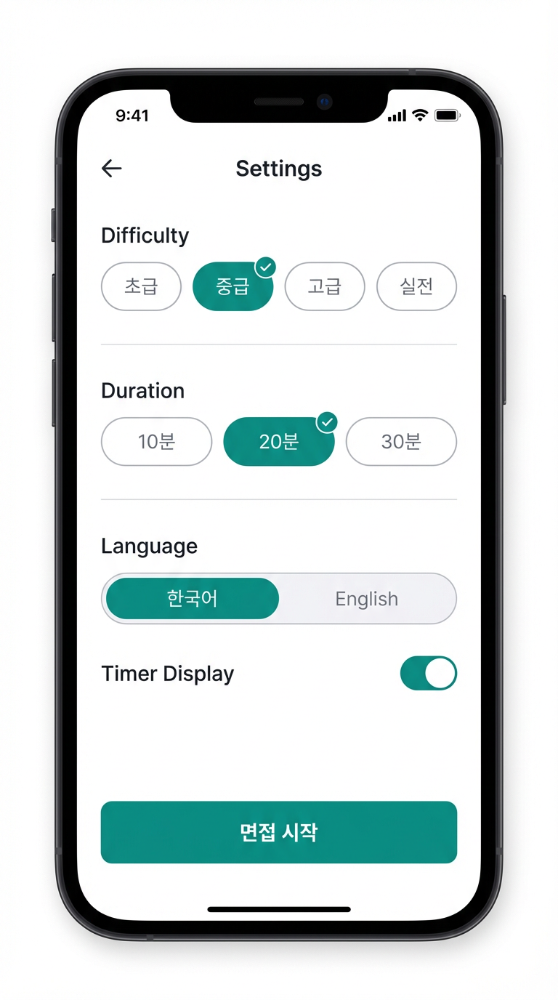

---

## 화면 13 [Phase 1]: AI 면접관 선택

### 시나리오

이취준이 면접 설정 완료 후 AI 면접관을 선택한다. 기본 3종은 무료(🆓), 유료 마켓 페르소나는 Teal 테두리와 구분된 별도 섹션에 표시된다.

### 목적

면접 경험의 개인화 및 유료 페르소나 마켓 노출

### 핵심 요소

- 무료 기본 3종 카드: 🆓 배지, Teal 테두리, 페르소나명/스타일 태그
- 유료 마켓 섹션: "🔓 더 많은 면접관" + 카드 그리드 (잠금 아이콘, 크레딧 표시)
- 선택 시 카드 확대 + Teal 체크마크
- "이 면접관으로 시작" sticky CTA

```
Happy Path:
┌─────────────────────┐
│  ← AI 면접관 선택   │
│─────────────────────│
│ 무료 면접관         │
│ ┌────────┐ ┌───────┐│
│ │🆓 김지수│ │🆓 박상│││
│ │HR출신  │ │개발팀장│││
│ │#날카롭다│ │#기술중│││  ← 스타일 태그
│ └────────┘ └───────┘│
│    ┌───────────┐     │
│    │ 🆓 이지민  │     │
│    │  스타트업  │     │
│    │ #친근함    │     │
│    └───────────┘     │
│─────────────────────│
│ 🔓 마켓 페르소나    │
│ ┌────────┐ ┌───────┐│
│ │🔒 최현직│ │🔒 N사 │││
│ │🪙10크레딧││🪙15크레││
│ └────────┘ └───────┘│
│  → 더 많은 면접관   │
│─────────────────────│
│ ┌─────────────────┐ │
│ │  이 면접관으로   │ │  ← Teal
│ └─────────────────┘ │
└─────────────────────┘
```

```
빈 상태 (마켓 페르소나 없음):
┌─────────────────────┐
│ 🔓 마켓 페르소나    │
│                     │
│  아직 현직자 페르소나│
│  가 없어요           │
│  AI 김지수로 연습   │
│  해보기 →           │
│                     │
└─────────────────────┘
```

### 진입 params

`{ difficulty, duration, language }` (화면 12에서 전달)

※ 화면 23(마켓 상세)에서 면접 시작 시 → 화면 12 경유 후 진입 (`from: 'market'` 파라미터 포함)

### 이탈 params

`{ personaId, difficulty, duration, language }` → 화면 3(채팅 면접)으로 전달

### 상태 변형

- 기본: 김지수(첫 번째 카드) 선택된 상태로 진입
- 유료 페르소나 탭 시: 크레딧 부족이면 화면 20(크레딧 게이트) 진입
- 페르소나 없음(콜드 스타트): 빈 상태 메시지 + AI 페르소나 CTA

### 시안 이미지

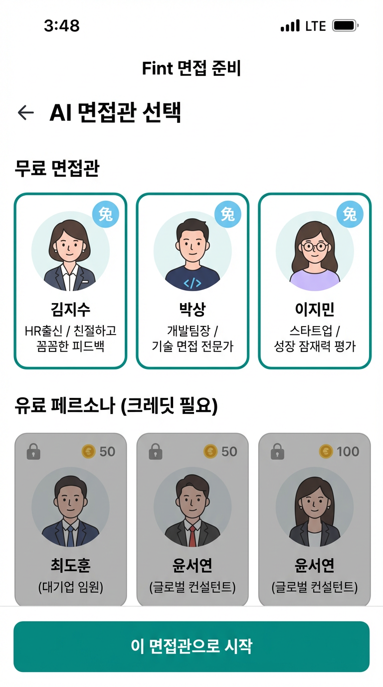

---

## 화면 14 [Phase 1]: 크레딧 획득 UI

### 시나리오

이취준이 면접을 완료하고 결과 화면에서 크레딧이 적립되는 애니메이션을 본다. 획득량에 따라 다른 방식으로 표현된다.

### 목적

크레딧 획득의 즐거움을 시각화하여 반복 행동 유도

### 핵심 요소

- 소액(1~5크레딧): Toast 알림 (탭 바 위 16px, 1.5초 fade-out)
- 중액(6~19크레딧): Toast + 코인 포물선 애니메이션 (우하단→우상단 배지)
- 대량(20+크레딧): 전체화면 크레딧 적립 모달
- `prefers-reduced-motion` 대응: 포물선 → 정적 "+N 크레딧" 텍스트 배지

```
소액 Toast:
┌─────────────────────┐
│                     │
│  [화면 내용]        │
│                     │
│ ┌─────────────────┐ │
│ │🪙 +CREDIT_REVIEW │ │  ← color-coin-light(#FEF3C7) bg, color-coin(#F59E0B) text, 1.5초
│ │_WRITE 크레딧 적립│ │
│ └─────────────────┘ │
│ ━━━━━━━━━━━━━━━━━━━ │  ← 탭 바
└─────────────────────┘
```

#### 중액 Toast (6~19크레딧): Toast + 코인 파라볼라 애니메이션
```
┌─────────────────────┐
│ 🪙 +N크레딧 획득!   │  ← color-coin-light bg, 상단 Toast
└─────────────────────┘
         ↑ (코인 파라볼라: 발원점→Toast, z-index: overlay)
```
※ Toast와 파라볼라 동시 시작 (0ms offset)

```
대량 획득 모달 (20+):
※ `prefers-reduced-motion: reduce` 설정 시: 코인 파라볼라·폭죽 애니메이션 생략 → 정적 모달 (파티클 없음). WCAG 2.3.1 준수.
┌─────────────────────┐
│  [배경 딤 처리]     │
│                     │
│ ┌─────────────────┐ │
│ │  🎉 +20 크레딧  │ │
│ │                  │ │
│ │  🪙🪙🪙🪙🪙      │ │
│ │  면접 완료 보상  │ │
│ │  잔액: N 크레딧  │ │
│ │ ┌─────────────┐ │ │
│ │ │    확인      │ │ │
│ │ └─────────────┘ │ │
│ └─────────────────┘ │
└─────────────────────┘
```

### 진입 params

`{ amount: number, reason: 'interview_complete' | 'review_write' | 'streak_bonus' | 'purchase' | 'cheer_received' }`

> `purchase` → 대량 모달(20+) 경로, `cheer_received` → 소액 Toast 경로

### 이탈 params

자동 dismiss 후 이전 화면 복귀

### 상태 변형

- 소액(1~5): Toast만
- 중액(6~19): Toast + 포물선 (또는 모션 감소 시 정적 배지)
- 대량(20+): 전체 모달
- 이미 최대 일일 획득: "오늘의 보상은 이미 받으셨어요" Toast

### 시안 이미지

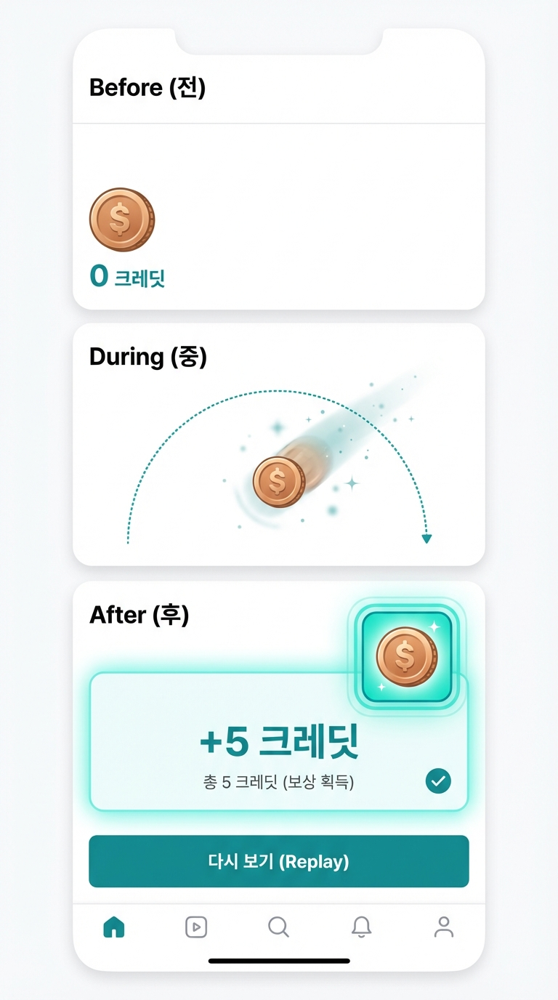

---

## 화면 15 [Phase 1]: 레벨업/배지 시스템

### 시나리오

이취준이 프로필 탭에서 자신의 레벨과 배지 현황을 확인한다. 획득한 배지는 컬러로, 미획득은 회색 잠금으로 표시된다.

### 목적

성취감 시각화로 지속적 면접 동기 부여

### 핵심 요소

- 레벨 표시: "Lv.N 면접 챌린저" + XP 프로그레스 바 (Teal)
- 배지 그리드 (3열): Bronze #CD7F32 / Silver #A8A9AD / Gold #F59E0B / Special #7C3AED
- 미획득 배지: 회색 잠금 아이콘 + 조건 툴팁. 미획득 배지 탭 시: 하단 Sheet (1/3 높이) 슬라이드업 — 배지명, 달성 조건, 현재 진행상황 표시 (예: '면접 3회 완료 — 현재 1/3'). 닫기: ×버튼 또는 스와이프 다운.
- 레벨업 트리거: 레벨업 시 전체화면 플래시 + 배지 unlock 애니메이션
- ⚠ `prefers-reduced-motion: reduce` 설정 시: 레벨업 플래시 생략 → 즉시 'Lv.N 달성!' 오버레이 텍스트 + 진동(haptic) 피드백으로 대체. WCAG 2.3.1 준수.
- Special 배지(#7C3AED): 반드시 흰 배경(#FFFFFF) 카드 위에만 렌더링

```
배지 획득 상태:
┌─────────────────────┐
│  레벨 & 배지        │
│─────────────────────│
│  Lv.5 면접 챌린저   │
│  ████████░░  320XP  │  ← Teal 프로그레스
│  다음 레벨까지 80XP │
│─────────────────────│
│ 획득한 배지 (3/12)  │
│ ┌────┐ ┌────┐ ┌────┐│
│ │🥉첫│ │🥈3회│ │🥇10│││
│ │면접 │ │연속  │ │회완 │││
│ └────┘ └────┘ └────┘│
│─────────────────────│
│ 도전 중 배지        │
│ ┌────┐ ┌────┐ ┌────┐│
│ │🔒  │ │🔒  │ │🔒  │││
│ │30회 │ │스트 │ │완벽 │││
│ │완료 │ │릭30 │ │답변 │││
│ └────┘ └────┘ └────┘│
└─────────────────────┘
← 🥉 color-badge-bronze (#CD7F32) / 🥈 color-badge-silver (#A8A9AD) / 🥇 color-badge-gold (#F59E0B) / ⭐ Special color-badge-special (#7C3AED, 반드시 흰 배경 #FFFFFF 위에만 사용)
⚠ Special 배지 카드 배경: 반드시 #FFFFFF — color-surface (#F9FAFB) 사용 금지
← 미획득(잠금) 배지 아이콘: color-text-disabled (#D1D5DB), 텍스트: color-text-secondary
```

```
미획득 배지 그리드 (초기):
┌─────────────────────┐
│ 도전 중 배지        │
│ ┌────┐ ┌────┐ ┌────┐│
│ │🔒  │ │🔒  │ │🔒  │││
│ │면접  │ │스트 │ │후기 │││
│ │3회  │ │릭7일│ │작성 │││
│ └────┘ └────┘ └────┘│
│  아직 배지가 없어요  │
│  첫 면접을 시작해보 │
│  세요! →            │
└─────────────────────┘
```

### 진입 params

없음 (프로필 탭 내 섹션)

### 이탈 params

없음 (탭 내 스크롤)

### 상태 변형

- 초기(배지 없음): 빈 배지 그리드 + CTA
- 일반: 획득/미획득 혼합 그리드
- 레벨업 순간: 전체화면 플래시 + "Lv.N 달성!" 오버레이

### 시안 이미지

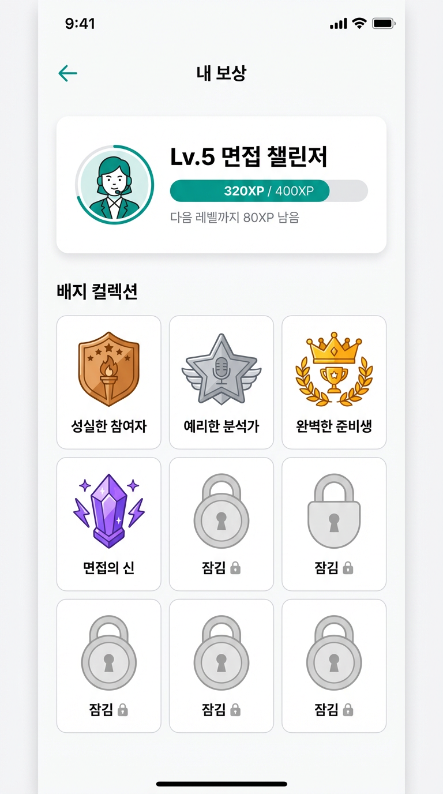

---

## 화면 16 [Phase 1 후반]: 인기 Q&A 패턴 뷰어

### 시나리오

이취준이 면접 결과 후 "고득점 패턴 보기" CTA를 탭한다. 크레딧이 충분하면 패턴 내용이 공개되고, 부족하면 블러 처리된 잠금 상태를 본다.

### 목적

Q&A 패턴 열람을 통한 학습 + 크레딧 소비 유도

### 핵심 요소

- 패턴 단위: 질문 + 고득점 답변 요약 + 점수 + 직군 태그
- 언락 상태: 패턴 전체 공개 + "이 패턴으로 연습" CTA
- 잠금 상태: 블러 오버레이 + lock 아이콘 + Error Red 테두리 + 크레딧 필요량 표시
- 직군/난이도 필터 칩

```
언락 상태:
┌─────────────────────┐
│  ← Q&A 패턴 뷰어   │
│─────────────────────│
│ 개발 · 중급 · ★4.8  │  ← 필터 칩
│─────────────────────│
│ Q. 가장 어려운 기술  │
│    적 문제를 해결한  │
│    경험을 말해주세요 │
│                     │
│ ✅ 고득점 답변 패턴 │
│ "상황-문제-행동-결과"│
│ STAR 구조 + 수치화  │
│ 점수: 88/100 ⭐     │
│                     │
│ ┌─────────────────┐ │
│ │ 이 패턴으로 연습 │ │  ← Teal
│ └─────────────────┘ │
└─────────────────────┘
```

```
잠금 상태 (크레딧 부족):
┌─────────────────────┐
│  ← Q&A 패턴 뷰어   │
│─────────────────────│
│ ┌─────────────────┐ │
│ │░░░░░░░░░░░░░░░░░│ │  ← 블러
│ │░ 🔒 ░░░░░░░░░░░│ │
│ │░░ CREDIT_PATTERN│ │
│ │░░░크레딧 필요░░░│ │
│ └─────────────────┘ │
│  ⚠ 크레딧이 부족해요│  ← Error Red #EF4444 border
│  충전하기 →         │
└─────────────────────┘
```

### 진입 params

`{ patternId?, jobCategory?, difficulty? }`

### 이탈 params

"이 패턴으로 연습" → 화면 12(면접 설정); 크레딧 부족 → 화면 20(게이트)

### 상태 변형

- 크레딧 충분: 언락 상태
- 크레딧 부족: 블러+잠금 오버레이, Error Red 테두리
- 패턴 없음(신규 앱): "아직 충분한 데이터가 없어요" 빈 상태

### 시안 이미지

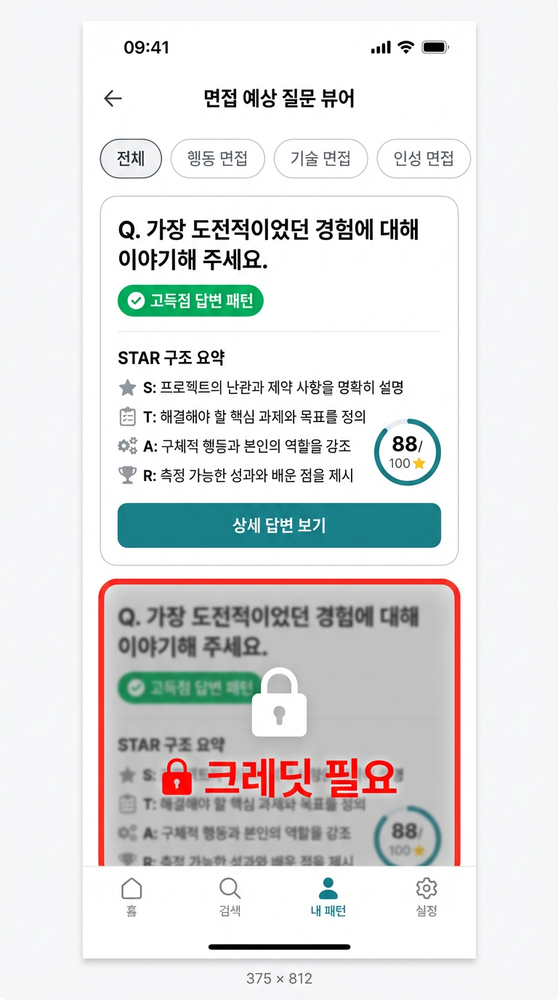

---

## 화면 17 [Phase 1]: 면접 후기 작성 CTA/폼

### 시나리오

이취준이 면접 결과 화면에서 "후기 작성" CTA를 탭한다. 별점과 한줄 후기를 작성하면 CREDIT_REVIEW_WRITE 크레딧을 받는다.

### 목적

커뮤니티 콘텐츠 생성 유도 + 크레딧 리워드 제공

### 핵심 요소

- 별점 (1~5, 필수): 탭하여 선택
- 한줄 후기 (20자 이상, 필수): 문자 카운터
- 상세 후기 (선택, 200자): 토글 가능
- 익명 토글 (기본 ON)
- 리워드 표시: "+CREDIT_REVIEW_WRITE 크레딧" Amber 배지
- 유효성 검사: 별점 미선택/한줄 20자 미만 시 버튼 비활성

```
Happy Path:
┌─────────────────────┐
│  ← 면접 후기 작성   │
│─────────────────────│
│ 🪙 후기 작성하고    │
│ +CREDIT_REVIEW_WRITE│
│ 크레딧 받기!        │
│─────────────────────│
│ 별점 *              │
│  ☆ ☆ ☆ ★ ☆        │  ← 4점 선택
│─────────────────────│
│ 한줄 후기 *         │
│ ┌─────────────────┐ │
│ │질문이 실무적이고  │ │
│ │도움이 됐어요     │ │
│ └─────────────────┘ │
│                20자 │  ← 카운터
│─────────────────────│
│ 상세 후기 (선택)    │
│ ┌─────────────────┐ │
│ │ 접기 ∧           │ │
│ └─────────────────┘ │
│─────────────────────│
│ 익명으로 게시 ●     │
│─────────────────────│
│ ┌─────────────────┐ │
│ │  후기 제출하기   │ │  ← Teal (유효 시 활성)
│ └─────────────────┘ │
└─────────────────────┘
```

```
유효성 실패 상태:
┌─────────────────────┐
│ 한줄 후기 *         │
│ ┌─────────────────┐ │
│ │ 좋았어요         │ │  ← 5자 (미달)
│ └─────────────────┘ │
│ ⚠ 20자 이상 입력   │  ← Error Red
│ 해주세요  5/20      │
│─────────────────────│
│ ┌─────────────────┐ │
│ │  후기 제출하기   │ │  ← 비활성 (Gray)
│ └─────────────────┘ │
└─────────────────────┘
```

### 유효성 검사 조건

| 조건 | 메시지 | 행동 |
|------|--------|------|
| 별점 미선택 | "별점을 선택해주세요" | 버튼 비활성 |
| 한줄 20자 미만 | "20자 이상 입력해주세요 N/20" | 버튼 비활성 |
| 상세 200자 초과 | "200자 이하로 입력해주세요 N/200" | 제출 불가 |

### 진입 params

`{ sessionId, personaId }` (면접 세션 참조)

### 이탈 params

제출 완료 → 화면 24(커뮤니티 탭, "커뮤니티에서 보기" 선택 시) 또는 화면 4(결과, 취소 시)

### 상태 변형

- 작성 중: 유효성 실시간 검사
- 제출 완료: "🪙 +CREDIT_REVIEW_WRITE 크레딧 적립!" Toast + 커뮤니티 탭 이동 옵션

### 시안 이미지

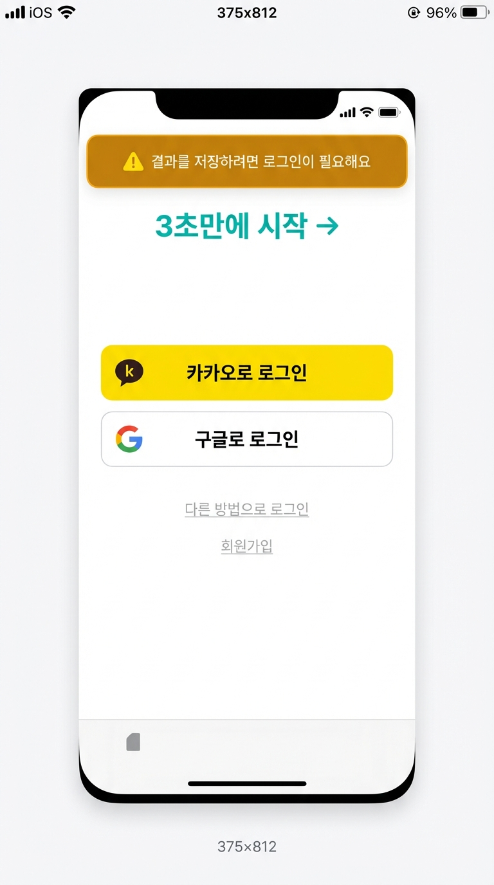

---

## 화면 18 [Phase 1]: 프로필 탭

### 시나리오

이취준이 프로필 탭에 접근한다. 레벨/XP/배지/면접 히스토리가 표시된다. 현직자는 다른 뷰를 본다.

### 목적

성취 현황 확인 + 현직자 등록 진입점

### 핵심 요소

- 취준생 뷰: 프로필 + 레벨/XP바 + 배지 + 면접 히스토리 + 크레딧 잔액
- 현직자 뷰: 페르소나 관리 + 크레딧 수익 + 답장률 + 활동 현황
- "현직자로 등록하기" CTA (취준생 뷰 하단)
- 크레딧 잔액: Amber #F59E0B 배지로 표시

```
취준생 뷰:
┌─────────────────────┐
│  프로필             │
│─────────────────────│
│  👤 이취준          │
│  이취준@email.com   │
│─────────────────────│
│  Lv.5 · 🔥 3일 연속│
│  ████████░░  320XP  │
│─────────────────────│
│  🪙 45 크레딧       │  ← Amber
│─────────────────────│
│ 🏅 배지 (3개)       │
│ 🥉 🥈 🔒 🔒 →      │
│─────────────────────│
│ 최근 면접 히스토리  │
│ · 3/23 개발 중급 88점│
│ · 3/22 개발 중급 74점│
│─────────────────────│
│ ┌─────────────────┐ │
│ │ 현직자로 등록하기│ │  ← → 화면 30
│ └─────────────────┘ │
└─────────────────────┘
```

```
현직자 뷰:
┌─────────────────────┐
│  프로필             │
│─────────────────────│
│  👤 최현직 (현직자) │
│─────────────────────│
│  📊 내 페르소나 현황 │
│  면접 42회 완료     │
│  답장률: 95%        │
│─────────────────────│
│  🪙 수익: 126크레딧 │
│─────────────────────│
│ ┌─────────────────┐ │
│ │ 페르소나 설정    │ │
│ └─────────────────┘ │
└─────────────────────┘
```

### 진입 params

없음 (탭 직접 접근)

### 이탈 params

"현직자 등록" → 화면 30

### 상태 변형

- 취준생(기본): 취준생 뷰
- 현직자: 현직자 뷰
- 비로그인: 로그인 유도 화면 (소셜 로그인 CTA)

### 시안 이미지

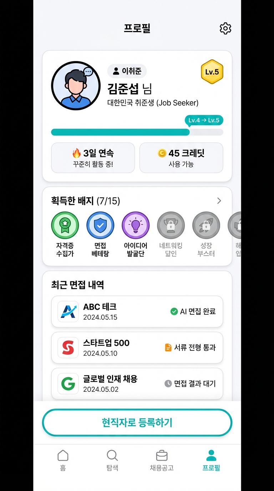

---

## 화면 19 [Phase 1]: Aha Moment + 스트릭 달성 축하 모달

### 시나리오

이취준이 첫 면접을 완료한 직후 Aha Moment를 경험한다. 화면 4(결과 리포트) 이후 레이어 스택 순서로 표시된다.

### 목적

첫 면접 완료의 성취감 극대화 + 크레딧 리워드 전달

### 핵심 요소

레이어 스택 ASCII 다이어그램:

```
[화면 4 결과 리포트]
    ↓ 크레딧 획득 트리거
[Teal 풀스크린 플래시 0.5초 — #0D9488 배경]
    ⚠ `prefers-reduced-motion: reduce` 설정 시: Teal 풀스크린 플래시 생략 → 즉시 '🎉 첫 면접 완료!' 카드 모달로 대체. WCAG 2.3.1 준수.
    ↓ 동시에
[크레딧 획득 Toast — "+CREDIT_INTERVIEW_COMPLETE 크레딧"]
    ↓ 플래시 종료 후
[결과 리포트 화면 유지 — 스트릭 미니 배지 추가]
    ↓ 스트릭 7일 달성 시에만
[스트릭 달성 축하 모달]
    ↓ 모달 닫기
[화면 4 복귀]
```

```
Aha Moment 풀스크린:
┌─────────────────────┐
│                     │  ← Teal #0D9488 배경
│                     │
│  🎉                 │
│  첫 면접 완료!      │  ← 흰 텍스트
│  78점 🎉              │  ← type-h1 weight 700 color-white
│                     │
│  🪙 +CREDIT_        │
│  INTERVIEW_COMPLETE  │
│  크레딧 획득!       │
│                     │
│  (0.5초 후 자동종료)│
│                     │
└─────────────────────┘
```

```
스트릭 달성 모달 (7일 달성 시):
┌─────────────────────┐
│  [배경 딤]          │
│ ┌─────────────────┐ │
│ │  🔥 7일 스트릭   │ │
│ │  달성!           │ │
│ │  🔥 파티클 이펙트 (2초) │ │
    ⚠ `prefers-reduced-motion: reduce` 설정 시: 🔥 파티클 생략 → 정적 스트릭 불꽃 아이콘 + 'N일 연속 달성!' 텍스트로 대체. WCAG 2.3.1 준수.
│ │                  │ │
│ │  🪙 +CREDIT_     │ │
│ │  STREAK_BONUS_7  │ │
│ │  보너스 크레딧!  │ │
│ │                  │ │
│ │ ┌─────────────┐  │ │
│ │ │내일도 오기 🔥│  │ │  ← Teal
│ │ └─────────────┘  │ │
│ └─────────────────┘ │
└─────────────────────┘
```

### 상세 규칙 (Phase 2 명세 4-1 통합)

> 🔗 이 섹션은 4-1(Aha Moment) 상세 명세를 통합합니다. 4-1 섹션 참조.

- 스트릭 달성 임박 알림: "내일도 하면 7일 달성!" (결과 화면 하단)
- 스트릭 회복 모달 (스트릭이 깨진 경우):
  - 제목: "스트릭이 끊겼어요 😢"
  - 내용: `-CREDIT_STREAK_RECOVER 크레딧으로 복구 가능`
  - CTA 1: "복구하기" (Teal)
  - CTA 2: "포기" (텍스트 링크) → 스트릭 0 리셋 + 모달 dismiss → 홈 탭(화면 2) 복귀

### 진입 params

`{ sessionId, streakDay, isStreakMilestone: boolean }`

### 이탈 params

자동 종료 후 화면 4 유지

### 상태 변형

- 첫 면접 완료: Aha Moment 풀스크린 + 크레딧 Toast
- 스트릭 7일 달성: 추가 축하 모달
- 스트릭 깨짐: 회복 모달 (크레딧 차감 옵션)

### 시안 이미지

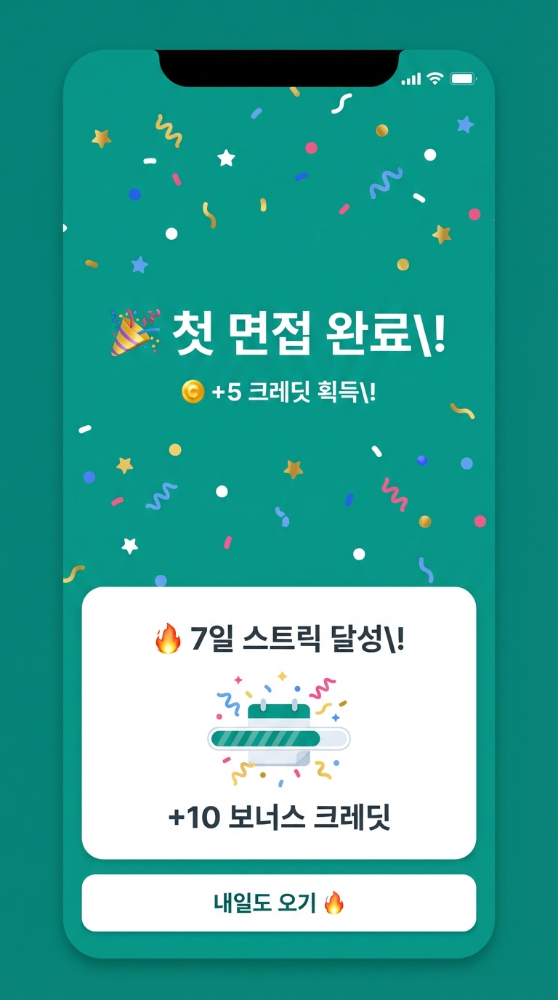

---

## 화면 20 [Phase 1]: 크레딧 부족 게이트/업셀

### 시나리오

이취준이 유료 페르소나로 면접하려 할 때 크레딧이 부족하다. Bottom sheet가 올라와 옵션을 제시한다.

### 목적

크레딧 부족 시 무료 대안과 유료 충전을 제시하여 이탈 방지

### 핵심 요소

- Bottom sheet (화면 50% 높이)
- 크레딧 부족 = Error Red #EF4444 액센트 (Amber 아님!)
- "지금 필요: N크레딧 / 내 잔액: M크레딧" 정확한 수치 표시
- CTA 1순위: "면접 완료해서 채우기 → +CREDIT_INTERVIEW_COMPLETE" (무료, Teal)
- CTA 2순위: "크레딧 충전하기" (결제, Teal outline)
- "취소" 텍스트 링크
- 드래그 다운 또는 배경 탭 → '취소' 동작과 동일 (`returnTo` 화면 복귀). 시트 외부: 반투명 딤(rgba 0,0,0,0.5) 적용.

```
Happy Path (Bottom sheet):
┌─────────────────────┐
│  [배경 화면]        │
│                     │
│                     │
│─────────────────────│ ← Bottom sheet 시작
│ ⚠ 크레딧이 부족해요│  ← ⚠ color-warning (#EF4444)
│─────────────────────│
│ 필요: N크레딧       │
│ 현재: M크레딧       │
│─────────────────────│
│ ┌─────────────────┐ │
│ │무료 면접 완료로   │ │  ← Teal (1순위)
│ │채우기 →+5크레딧  │ │
│ └─────────────────┘ │
│ ┌─────────────────┐ │
│ │  크레딧 충전하기  │ │  ← Teal outline (2순위)
│ └─────────────────┘ │
│       취소           │  ← 텍스트 링크
└─────────────────────┘
```

### 진입 params

`{ requiredCredits: number, currentCredits: number, returnTo: RouteString }`

### 이탈 params

- "면접 완료로 채우기" → 화면 12(면접 설정, 무료 페르소나 기본값)
- "충전하기" → 화면 25(크레딧 충전) with `{ from: 'gate', returnTo }`
- "취소" → `returnTo` 화면 복귀

### 상태 변형

- 기본: Bottom sheet 표시
- 결제 실패 후 재진입: **`currentCredits` 서버 재조회 필수** — 재진입 시 최신 잔액 반영 (optimistic update 금지)
- 결제 성공 후: `returnTo` 화면으로 즉시 복귀

### 시안 이미지

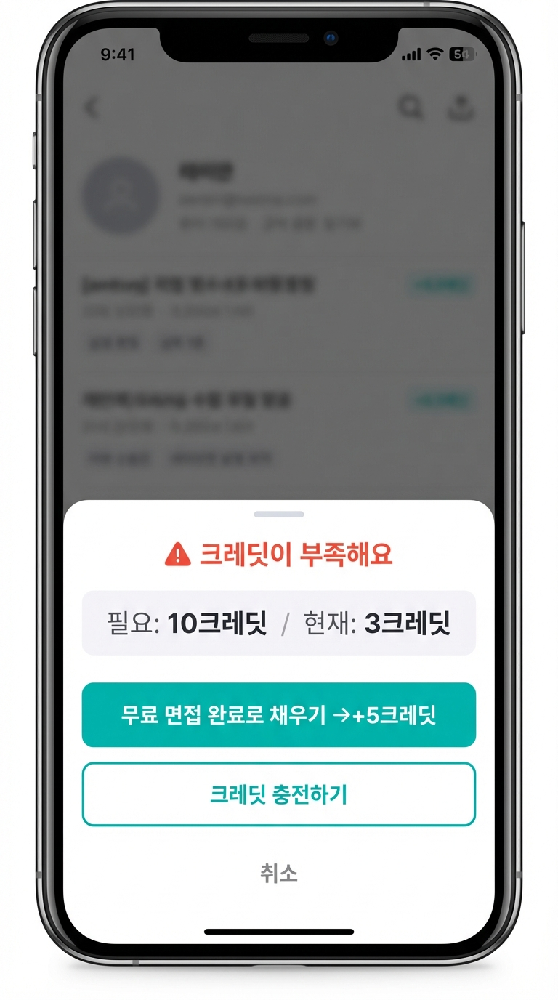

---

## 화면 21 [Phase 1]: 소셜 로그인 보강

> 🔗 이 화면은 기존 화면 4-1(로그인/가입 상세) 보강입니다. 4-1 섹션도 참조.

### 시나리오

이취준이 비로그인 상태로 면접을 완료한 후 결과 저장을 위해 로그인을 시도한다.

### 목적

OAuth 콜백 상태 처리 + 비로그인 결과 마이그레이션 안내

### 핵심 요소

- 카카오/구글 OAuth 버튼 (브랜드 정합성)
- OAuth 콜백 로딩 상태: 리다이렉트 중 Teal 스피너
- OAuth 에러 상태: `access_denied` 등 에러 코드별 메시지
- 비로그인 결과 마이그레이션 배너: "지금 저장하지 않으면 결과가 사라져요"
- "3초만에 시작" 마이크로카피

```
로그인 화면:
┌─────────────────────┐
│  ← 로그인           │
│─────────────────────│
│  ⚠ 결과를 저장하려 │
│  면 로그인이 필요해 │
│  요. 지금 결과가 사 │
│  라집니다.          │
│─────────────────────│
│  3초만에 시작 →     │
│                     │
│ ┌─────────────────┐ │
│ │ 🟡 카카오로 로그인│ │  ← 카카오 노란색
│ └─────────────────┘ │
│ ┌─────────────────┐ │
│ │ 🔵 구글로 로그인 │ │  ← 구글 파란색
│ └─────────────────┘ │
└─────────────────────┘
```

```
OAuth 콜백 로딩:
┌─────────────────────┐
│                     │
│   ◯ 로그인 중...    │  ← Teal 스피너
│   카카오 연결 중     │
│                     │
└─────────────────────┘
```

```
OAuth 에러:
┌─────────────────────┐
│ ⚠ 로그인에 실패했   │
│   어요              │
│                     │
│ access_denied:      │
│ 카카오 권한을 거부  │
│ 하셨어요            │
│                     │
│ ┌─────────────────┐ │
│ │  다시 시도하기   │ │
│ └─────────────────┘ │
│  다른 방법으로 →    │  (카카오 오류 시 → 구글 버튼 강조, 구글 오류 시 → 카카오 버튼 강조. 두 방법 모두 실패 시 → 게스트 모드 진입 옵션)
└─────────────────────┘
```

### 진입 params

`{ returnTo?, prefilledResult? }` (비로그인 결과 임시 저장)

### 이탈 params

로그인 성공 → `returnTo` 복귀 (결과 마이그레이션 포함)

### 상태 변형

- 비로그인 결과 존재: 마이그레이션 배너 표시
- OAuth 콜백 중: Teal 스피너
- OAuth 에러: 에러 코드별 메시지 + 재시도 CTA

### 시안 이미지


---

## Phase 2 신규 화면 (22~31)

---

## 화면 22 [Phase 2]: 홈 피드 탭 구조

> 🔗 기존 4-3 명세(홈 피드)의 상세 규칙은 아래 섹션을 참조. 이 화면은 4-3을 표준 화면으로 승격합니다.

### 시나리오

이취준이 홈 탭에서 개인화된 면접 후기/아차포인트/커뮤니티 카드 피드를 본다.

### 목적

콘텐츠 소비를 통한 앱 잔류 시간 증가 + 면접 동기 자극

### 핵심 요소

- 상단 바: 크레딧 잔액(Amber) + 🔥 스트릭 미니 배지
- 피드 탭: 추천 / 팔로잉
- 카드 타입별 컬러 바: 후기=Teal / 아차=Amber / 커뮤니티=Gray
- 직군/난이도 필터 칩 바 (가로 스크롤)
- FAB (우하단 면접 시작, 56px, 탭 바 +16px)
- 인기 페르소나 가로 스크롤 (카드 160px, peek 20px)

```
Happy Path:
┌─────────────────────┐
│ 🪙45  🔥3일 연속    │  ← 상단 바
│─────────────────────│
│ [추천] [팔로잉]     │  ← 피드 탭
│─────────────────────│
│ 전체 개발 마케팅 →  │  ← 필터 칩
│─────────────────────│
│ ┌─────────────────┐ │
│ │▌후기 개발·중급   │ │  ← Teal 바
│ │ "STAR 구조 답변  │ │
│ │  로 88점 받았어요"│ │
│ └─────────────────┘ │
│ ┌─────────────────┐ │
│ │▌아차 마케팅·초급 │ │  ← ▌ color-coin (#F59E0B), 3px left border (경제적 강조, badge-gold 아님)
│ │ "수치 없는 대답  │ │
│ │  은 감점 직행"   │ │
│ └─────────────────┘ │
│ ┌─────────────────┐ │
│ │▌커뮤니티 인기글  │ │  ← Gray 바
│ │ "면접 3일 전 체  │ │
│ │  크리스트"       │ │
│ └─────────────────┘ │
│               [🎯] │  ← [🎯] = 면접 시작 FAB (화면 12로 이동)
└─────────────────────┘
```

**스트릭 표시 규칙**: 🔥 아이콘은 streak 3일+ 달성 시만 표시. 1-2일: 'N일 연속' 텍스트만 표시.

```
빈 상태 (팔로잉 없음):
┌─────────────────────┐
│ [팔로잉] 탭         │
│                     │
│  이번 주 N명이      │
│  첫 면접을 완료     │
│  했어요!            │
│                     │
│  ┌───────────────┐  │
│  │첫 면접 시작하기│  │  ← Teal CTA
│  └───────────────┘  │
└─────────────────────┘
```

### 상세 규칙 (Phase 2 명세 4-3 통합)

> 🔗 기존 `### 4-3. 홈 피드` 섹션의 세부 규칙 참조 (카드 너비 160px, peek 20px, FAB 위치 등)

### 진입 params

없음 (홈 탭 직접 접근)

### 이탈 params

FAB → 화면 12(면접 설정); 카드 탭 → 화면 24(커뮤니티 탭, filterJobCategory 전달)

### 상태 변형

- 첫 방문: "첫 면접을 시작해보세요!" CTA 전면 배치
- 추천 탭: 개인화 피드
- 팔로잉 탭: 팔로잉 없음 빈 상태

### 시안 이미지

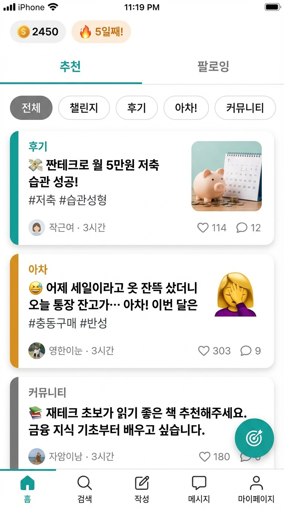

---

## 화면 23 [Phase 2]: 페르소나 마켓 목록/상세

> 🔗 기존 4-4 명세(페르소나 마켓)의 상세 규칙은 아래 섹션을 참조. 이 화면은 4-4를 표준 화면으로 승격합니다.

### 시나리오

이취준이 마켓 탭에서 현직자 페르소나를 탐색하고 상세 화면에서 면접 스타일을 확인 후 구매를 결정한다.

### 목적

유료 페르소나 마켓 탐색 + 크레딧 소비 유도

### 핵심 요소 (목록)

- 직군 필터 칩: 전체/개발/마케팅/디자인/기획/영업/기타
- 정렬: 추천순/인기순/최신순
- 페르소나 카드: 아바타 + 이름 + 익명 회사 + 평점 + 🪙 크레딧 예고
- 콜드 스타트 빈 상태: AI 페르소나 대체 CTA

### 핵심 요소 (상세)

- 페르소나 소개: 직군/연차/면접 스타일
- 면접 후기 잠금: 크레딧 소비로 열람
- sticky bottom CTA: "이 면접관으로 면접하기"
- 크레딧 부족 시: "🪙 부족 — 충전하기" (비활성화 금지)

```
목록 화면:
┌─────────────────────┐
│  마켓               │
│─────────────────────│
│ 전체 개발 마케팅 →  │  ← 필터 칩
│─────────────────────│
│ ┌─────┐ ┌─────┐    │
│ │👤   │ │👤   │    │
│ │최현직│ │N사  │    │
│ │개발팀│ │마케팅│   │
│ │★4.8  │ │★4.6  │   │
│ │🪙10  │ │🪙15  │   │
│ └─────┘ └─────┘    │
│ ┌─────┐ ┌─────┐    │
│ │👤   │ │🤖   │    │
│ │S사  │ │AI   │    │
│ │기획팀│ │김지수│   │
│ │★4.5  │ │🆓   │   │
│ └─────┘ └─────┘    │
└─────────────────────┘
```

```
상세 화면:
┌─────────────────────┐
│  ← 최현직 개발팀장  │
│─────────────────────│
│  👤 최현직          │
│  N사 개발팀장       │
│  면접 스타일: 기술  │
│  깊이 검증형        │
│─────────────────────│
│ 면접 후기           │
│ ┌─────────────────┐ │
│ │ 🔒 후기 보기     │ │  ← 크레딧 소비
│ │ 🪙 CREDIT_REVIEW │ │
│ └─────────────────┘ │
│                     │
│ 면접 1회당 🪙 3크레 │
│ 딧이 이 현직자에게  │
│ 지급됩니다          │
│─────────────────────│
│ ┌─────────────────┐ │
│ │이 면접관으로 면접│ │  ← sticky CTA (Teal)
│ └─────────────────┘ │
└─────────────────────┘
```

```
빈 상태 (콜드 스타트):
┌─────────────────────┐
│  마켓               │
│                     │
│  아직 현직자 페르소 │
│  나가 없어요        │
│                     │
│  AI 김지수로        │
│  연습해보기 →       │  ← Teal
│                     │
└─────────────────────┘
```

### 상세 규칙 (Phase 2 명세 4-4 통합)

> 🔗 기존 `### 4-4. 페르소나 마켓` 섹션의 카드 너비, 크레딧 수치, 정렬 옵션 참조

### 진입 params (상세)

`{ personaId }`

### 이탈 params

"면접하기" → 화면 12 `{ personaId, from: 'market' }` — 화면 12에서 설정 후 화면 13으로 진입; 크레딧 부족 → 화면 20(게이트)

### 구매 후 UX

- 구매 완료 Toast: "🪙 페르소나 구매 완료!" (1.5초)
- 면접 시작 자동 전환: "3초 후 면접이 시작됩니다..." 카운트다운
- 구매 이력: 상세 화면에 "구매 완료 ✅" 배지 표시

### 상태 변형

- 목록: 카드 그리드 + 필터 칩
- 상세: 페르소나 소개 + 후기 잠금 + sticky CTA
- 콜드 스타트: AI 페르소나 대체 CTA

### 시안 이미지

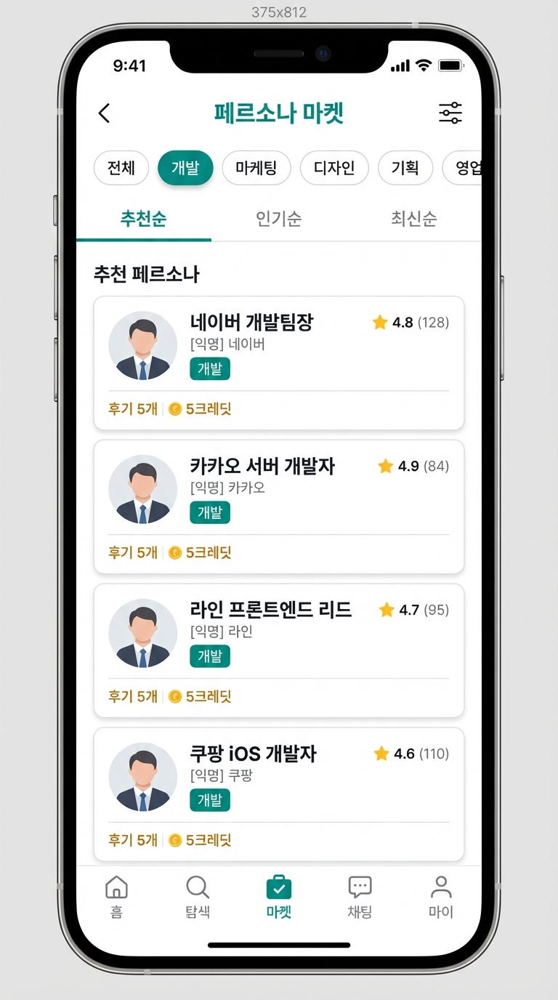

---

## 화면 24 [Phase 2]: 커뮤니티 탭

### 시나리오

이취준이 커뮤니티 탭에서 다른 유저의 면접 후기와 아차포인트를 읽는다. 글쓰기 FAB으로 후기를 작성할 수 있다.

### 목적

UGC(사용자 생성 콘텐츠) 소비/생성 + 커뮤니티 활성화

### 핵심 요소

- 피드: 최신/인기/직군별 정렬
- 글 타입 구분: 면접 후기(Teal 바) / 아차포인트(Amber 바) / 인기글(Gray 바)
- 익명 프로필 지원
- 글쓰기 FAB (우하단, 56px)
- 빈 상태 (글 없음)

```
Happy Path:
┌─────────────────────┐
│  커뮤니티           │
│─────────────────────│
│ [최신] [인기] [직군]│  ← 정렬 탭
│─────────────────────│
│ ┌─────────────────┐ │
│ │▌후기 · 개발      │ │
│ │ 익명 · 3분 전    │ │
│ │ "STAR 구조 쓰니  │ │
│ │  88점 받았어요"  │ │
│ │ ♥ 24  💬 8      │ │
│ └─────────────────┘ │
│ ┌─────────────────┐ │
│ │▌아차 · 마케팅    │ │  ← Amber 바
│ │ 익명 · 1시간 전  │ │
│ │ "수치 없는 답변  │ │
│ │  은 감점 직행"   │ │
│ └─────────────────┘ │
│               [✏️] │  ← FAB (→ 화면 17)
└─────────────────────┘
```

```
빈 상태:
┌─────────────────────┐
│  커뮤니티           │
│                     │
│  아직 게시물이 없   │
│  어요               │
│                     │
│  첫 후기를 작성해   │
│  보세요! 🪙 크레딧  │
│  도 받아요          │
│                     │
│               [✏️] │
└─────────────────────┘
```

### 진입 params

없음 (탭 직접 접근) 또는 `{ filterJobCategory? }`

### 이탈 params

FAB → 화면 17(후기 작성); 글 탭 → 글 상세 화면

### 상태 변형

- 일반: 피드 카드 목록
- 빈 상태: 글 없음 + CTA
- 필터 적용: 직군별 필터링

### 시안 이미지

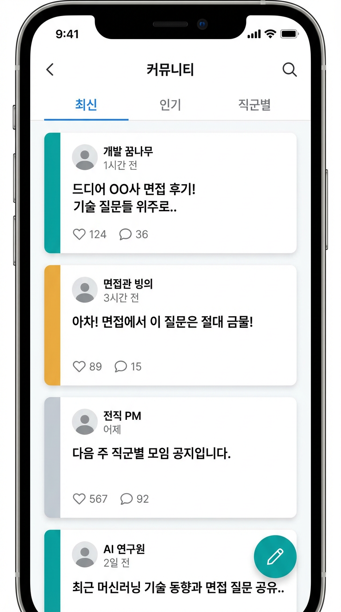

---

## 화면 25 [Phase 2]: 크레딧 충전 화면

> 🔗 기존 화면 8(크레딧 충전 골격) 내용을 이 화면으로 통합합니다. 결제 PG 상세 명세는 `docs/specs/fint/payment_spec.md` 참조.

### 시나리오

이취준이 크레딧 부족 게이트에서 "충전하기"를 탭한다. 패키지를 선택하고 카카오페이로 결제한다.

### 목적

크레딧 결제 플로우 전체 UX 명세

### 핵심 요소

- 패키지 선택 (3종): 스타터 / 인기(🔥 POPULAR) / 추천(✨ BEST VALUE)
- 결제 수단: 카카오페이 / 토스페이먼츠 ※ (신용카드는 PG사 확정 후 업데이트 — OI-2)
- 결제 플로우: 선택 → 확인 모달 → PG 처리 스피너 → 성공/실패

```
패키지 선택:
┌─────────────────────┐
│  ← 크레딧 충전      │
│─────────────────────│
│ ┌─────────────────┐ │
│ │  스타터          │ │
│ │  CREDIT_PKG_S   │ │
│ │  PRICE_PKG_S원  │ │
│ └─────────────────┘ │
│ ┌─────────────────┐ │
│ │ 🔥 인기          │ │  ← 강조
│ │  CREDIT_PKG_M   │ │
│ │  PRICE_PKG_M원  │ │
│ └─────────────────┘ │
│ ┌─────────────────┐ │
│ │ ✨ 추천 BEST     │ │
│ │  CREDIT_PKG_L   │ │
│ │  PRICE_PKG_L원  │ │
│ └─────────────────┘ │
│─────────────────────│
│ 결제 수단           │
│ ●카카오페이 ○토스페이먼츠│  ← [PG사 확정 후 업데이트 — OI-2]
│ ○토스               │
│ 기본 선택: 카카오페이. 결제 수단 미선택 시 '결제 수단을 선택해주세요' Toast + '결제하기' 비활성.
│─────────────────────│
│ ┌─────────────────┐ │
│ │  결제하기        │ │  ← Teal
│ └─────────────────┘ │
└─────────────────────┘
```

#### 결제 확인 모달 (Step 2)
```
╔══════════════════════╗
║   결제 확인           ║
╠══════════════════════╣
║ 상품: 스타터팩 🪙 30  ║
║ 금액: ₩ 3,900        ║
║ 결제수단: 카카오페이  ║
╠══════════════════════╣
║ 전자상거래법 제17조에 ║
║ 따라 결제 후 즉시 사  ║
║ 용 시 환불 불가합니다 ║
╠══════════════════════╣
║ [취소]  [결제하기 →]  ║
╚══════════════════════╝
```

```
결제 처리 중 스피너:
┌─────────────────────┐
│  [전체 오버레이]    │
│                     │
│   ◯ 결제 처리 중... │  ← Teal 스피너
│   잠시만 기다려주   │
│   세요              │
│                     │
└─────────────────────┘
```

```
결제 성공:
┌─────────────────────┐
│                     │
│  ✅ 결제 완료!      │  ← Teal
│                     │
│  🪙 CREDIT_PKG_M   │
│  크레딧이 충전됐어  │
│  요                 │
│                     │
│ ┌─────────────────┐ │
│ │  계속하기        │ │  ← returnTo 복귀
│ └─────────────────┘ │
└─────────────────────┘
```

```
결제 실패:
┌─────────────────────┐
│  ⚠ 결제에 실패했   │  ← Error Red
│    어요             │
│                     │
│  카드 한도를 초과   │
│  했어요             │
│                     │
│ ┌─────────────────┐ │
│ │  다시 시도하기   │ │  ← 화면 25 재진입 (currentCredits 서버 재조회)
│ └─────────────────┘ │
│  취소               │  ← returnTo 복귀
└─────────────────────┘
```

### 결제 플로우 단계

1. 패키지 선택 (화면 25)
2. 결제 확인 모달 (`price`, `credits`, `packageName`)
3. PG SDK 호출 → Teal 전체 오버레이 스피너
4. 성공: 서버 검증 → 크레딧 업데이트 → `returnTo` 복귀 (server-confirmed update, optimistic update 없음)
5. 실패: 에러 코드별 모달 → 재시도/취소

> PG 연동 상세: `docs/specs/fint/payment_spec.md` 참조

### 진입 params

`{ from?: 'gate', returnTo?: RouteString }`

### 이탈 params

결제 성공 → `returnTo`; 취소 → `returnTo` or 이전 화면

### 상태 변형

- 패키지 선택: 3종 카드
- 결제 중: Teal 스피너 오버레이
- 성공: 크레딧 충전 완료 + returnTo 복귀
- 실패: Error Red 에러 메시지 + 재시도/취소

### 시안 이미지

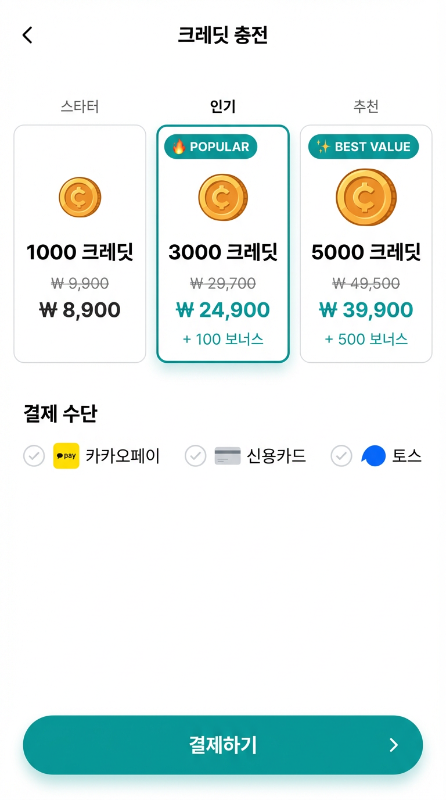

---

## 화면 26 [Phase 2]: 알림 센터

### 시나리오

이취준이 홈 상단 바의 🔔 아이콘 탭 또는 푸시 알림 탭으로 진입한다.

### 목적

알림 딥링크 처리 + 알림 히스토리 제공

### 핵심 요소

- 읽음/미읽음 구분 (미읽음 = Teal 좌측 바)
- 알림 타입별 딥링크 테이블:

| 알림 타입 | 딥링크 대상 | 비고 |
|-----------|------------|------|
| 스트릭 리마인더 | 면접 시작(화면 12) | 자정 전 알림 |
| 크레딧 획득 | 크레딧 내역(화면 18 내) | 획득 즉시 |
| 쪽지 답장 | 쪽지 상세(화면 7) | 현직자 답장 시 |
| 레벨업 | 프로필 배지 섹션(화면 18) | 레벨업 시 |

- 알림 설정 토글 (각 타입별 ON/OFF)
- 알림 설정: 우상단 '설정(⚙)' 아이콘 탭 → 알림 타입별 토글 (스트릭/크레딧/쪽지/레벨업 ON/OFF). 토글 OFF 시: 기존 알림 히스토리 유지, 새 알림 수신 중단. 배경 탭 → 이전 화면 복귀.
- 빈 알림 상태

```
알림 목록:
┌─────────────────────┐
│  ← 알림             │
│─────────────────────│
│ ┌─────────────────┐ │
│ │▌ 🔥 스트릭 리마  │ │  ← Teal 좌측 바 (미읽음)
│ │  인더            │ │
│ │  자정까지 2시간  │ │
│ │  남았어요!       │ │
│ └─────────────────┘ │
│ ┌─────────────────┐ │
│ │  🪙 크레딧 획득  │ │  ← 읽음 (Teal 바 없음)
│ │  +5크레딧 적립됨 │ │
│ │  1시간 전        │ │
│ └─────────────────┘ │
│ ┌─────────────────┐ │
│ │▌ 💬 쪽지 답장   │ │
│ │  최현직님이 답장 │ │
│ │  했어요          │ │
│ └─────────────────┘ │
└─────────────────────┘
```

```
빈 알림 상태:
┌─────────────────────┐
│  알림               │
│                     │
│  아직 알림이 없어요  │
│                     │
│  면접을 완료하면    │
│  스트릭 · 크레딧    │
│  알림을 받을 수 있  │
│  어요               │
└─────────────────────┘
```

### 진입 params

없음 (탭 또는 푸시 딥링크 `{ deeplink: { type, targetId } }`)

### 이탈 params

알림 탭 → 딥링크 대상 화면

### 상태 변형

- 미읽음 있음: Teal 좌측 바 표시
- 전체 읽음: Teal 바 없음
- 빈 알림: 빈 상태 CTA

### 시안 이미지

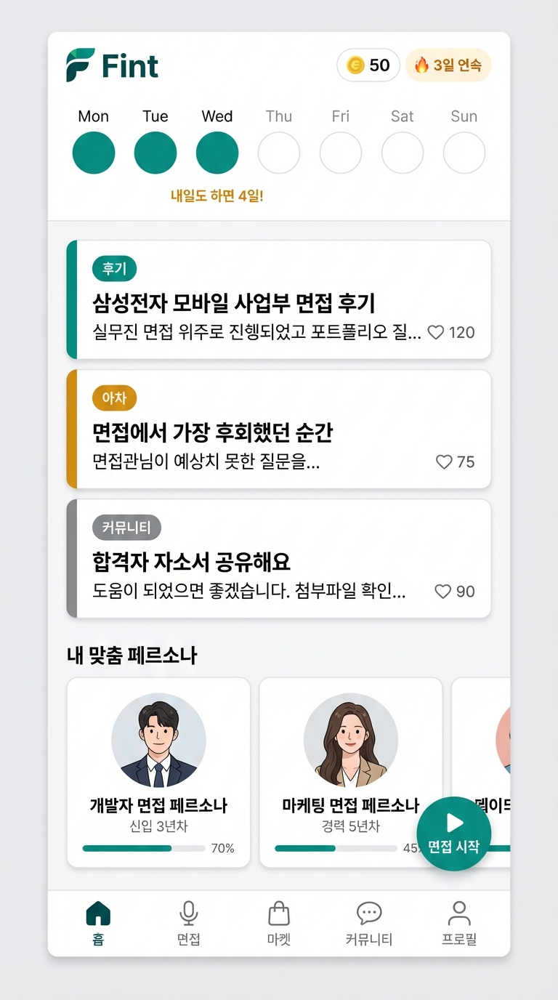  <!-- placeholder — 별도 알림센터 시안 미제작 -->

---

## 화면 27 [Phase 2]: 현직자 온보딩/인증 보강

> ※ Phase 1 기본 온보딩은 화면 9(Phase 1)에서 구현 완료. 화면 27은 Phase 2 보강 전용 (인증 절차 강화 + 스텝 추가). Phase 2 배포 시 화면 9를 화면 27로 대체한다.

### 시나리오

최현직이 프로필 탭에서 "현직자로 등록하기"를 탭하고 5단계 마법사를 통해 페르소나를 등록한다.

### 목적

현직자 페르소나 등록 + 이메일/재직증명서 인증

### 핵심 요소

- 5단계 마법사 (진행 바)
- 중간 저장: 7일 유지, 재진입 시 마지막 완료 단계에서 재개
- 인증 분기: 이메일 즉시 / 재직증명서 3영업일

```
1/5 기본 정보:
┌─────────────────────┐
│  ← 현직자 등록      │
│  ██░░░░░░░░  1/5   │  ← 진행 바
│─────────────────────│
│ 이름 (노출명)       │
│ ┌─────────────────┐ │
│ │ 최현직           │ │
│ └─────────────────┘ │
│ 한줄 소개           │
│ ┌─────────────────┐ │
│ │ N사 개발팀장 5년 │ │
│ └─────────────────┘ │
│─────────────────────│
│ ┌─────────────────┐ │
│ │       다음 →     │ │  ← Teal
│ └─────────────────┘ │
└─────────────────────┘
```

```
2/5 회사 정보:
┌─────────────────────┐
│  ← 현직자 등록      │
│  ████░░░░░░  2/5   │
│─────────────────────│
│ 회사명 (익명 표시)  │
│ ┌─────────────────┐ │
│ │ 실명 입력 → 자동 │ │
│ │ 익명화: "N사"    │ │
│ └─────────────────┘ │
│ 직군 · 연차         │
│ [개발 ▼] [5년 ▼]   │
│─────────────────────│
│ ┌─────────────────┐ │
│ │       다음 →     │ │
│ └─────────────────┘ │
└─────────────────────┘
```

#### Step 3/5 — 면접 스타일 설정
```
┌─────────────────────┐
│ ██████░░░░  3/5     │
│                     │
│ 면접 스타일          │
│ ○ 압박형            │
│ ○ 친화형            │
│ ● 균형형 (권장)     │
│                     │
│ 평균 질문 수: 8~12개 │
│ [다음 →]            │
└─────────────────────┘
```

#### Step 4/5 — 인증 방법 선택
```
┌─────────────────────┐
│ ████░░░░░░  4/5     │
│                     │
│ 재직 인증 방법       │
│ ○ 회사 이메일 인증   │
│ ● 재직증명서 업로드  │
│                     │
│ [파일 선택 📎]       │
│ (PDF/JPG, 최대 5MB) │
│ [다음 →]            │
└─────────────────────┘
```

#### Step 5/5 — 최종 확인 및 제출
```
┌─────────────────────┐
│ ██████████  5/5     │
│                     │
│ 입력 정보 확인       │
│ 이름: 홍길동         │
│ 회사: ABC Corp.     │
│ 인증: 재직증명서 ✓  │
│                     │
│ [수정하기] [제출 →] │
└─────────────────────┘
제출 후: 검토 중 배지 (24~48시간) → 화면 18 복귀
```

```
재직증명서 대기 상태 (프로필 탭):
┌─────────────────────┐
│  프로필             │
│─────────────────────│
│  👤 최현직          │
│  ⏳ 인증 검토 중    │  ← Amber 배지
│  (재직증명서 심사   │
│   3영업일 소요)     │
│─────────────────────│
│  검토 완료 시 알림  │
│  을 드려요          │
│─────────────────────│
│  [서류 재제출]      │  ← 반려 시 활성화
└─────────────────────┘
```

### 반려 처리

- 반려 알림 → 프로필 탭에 "서류 재제출" CTA 활성
- 재제출: 마법사 중간 저장 데이터 7일 유지 → 마지막 완료 단계에서 재개 (데이터 초기화 없음)

### 진입 params

`{ from?: 'seeker_profile', userId }`

### 이탈 params

완료 → 화면 18(프로필, 현직자 뷰)

### 상태 변형

- 마법사 진행 중: 1~5단계 순차 입력
- 이메일 인증: 즉시 완료
- 재직증명서 인증: 대기 상태 (Amber 배지)
- 반려: 서류 재제출 CTA 활성화

### 시안 이미지

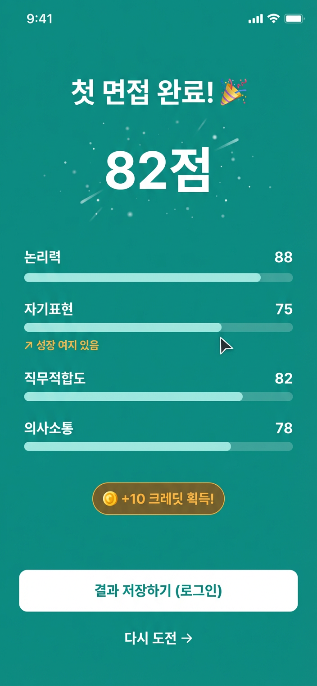  <!-- placeholder — 현직자 온보딩 시안 미제작 -->

---

## 화면 28 [Phase 2]: 익명 응원 폭탄

### 시나리오

이취준이 친구에게 익명 응원을 보내려 한다. 수신자가 옵트아웃 상태인지 먼저 확인한다.

### 목적

바이럴 기능 + 크레딧 소비 + 옵트아웃 보호

### 핵심 요소

- 발송 전 서버 옵트아웃 검증 (UI 차단)
- 메시지 5종 선택
- 크레딧 차감 확인
- 수신 이펙트 화면
- 옵트아웃 플로우

```
발송 화면 (옵트아웃 검증 통과):
┌─────────────────────┐
│  ← 응원 보내기      │
│─────────────────────│
│ 👤 이취준에게       │
│─────────────────────│
│ 응원 메시지 선택    │
│ ○ "화이팅! 넌 할 수 │
│    있어! 💪"        │
│ ● "오늘도 한 발짝   │
│    전진! 🔥"        │
│ ○ "면접 잘 볼거야!  │
│    믿어! ✨"        │
│─────────────────────│
│ 🪙 CREDIT_CHEER_    │
│    SEND 크레딧 차감  │
│─────────────────────│
│ ┌─────────────────┐ │
│ │  응원 보내기     │ │  ← Teal
│ └─────────────────┘ │
└─────────────────────┘
```

```
옵트아웃 상태 (발송 불가):
┌─────────────────────┐
│  ← 응원 보내기      │
│─────────────────────│
│ ⚠ 이 친구는 응원    │
│   수신을 끈 상태예요 │
│                     │
│ 다른 친구에게 보내  │
│ 보는 건 어떨까요?   │
│                     │
│ ┌─────────────────┐ │
│ │       확인       │ │
│ └─────────────────┘ │
└─────────────────────┘
```

```
수신 이펙트 화면:
┌─────────────────────┐
│                     │
│  💌 익명의 친구가   │
│  응원을 보냈어요!   │
│                     │
│  🔥 오늘도 한 발짝  │
│     전진! 🔥        │
│                     │
│  [confetti 이펙트]  │
│                     │
│ ┌─────────────────┐ │
│ │  나도 면접해보기  │ │  ← CTA
│ └─────────────────┘ │
└─────────────────────┘
```

### 옵트아웃 설정 흐름

설정 → 응원 수신 OFF → "꺼도 이미 발송된 응원은 표시됩니다" 안내

### 크레딧 환급

옵트아웃 상태 검증 실패 시에만 환급 (발송 성공 후 환급 없음)

### 진입 params

`{ recipientId }`

### 이탈 params

발송 완료 → 이전 화면; 옵트아웃 → 이전 화면

### 상태 변형

- 옵트아웃 검증 통과: 메시지 선택 + 발송
- 옵트아웃 상태: 발송 불가 안내
- 수신 이펙트: confetti + CTA
- 크레딧 부족 시: '응원 보내기' 버튼 비활성 (Gray) + '크레딧이 부족해요. 충전하기 →' color-warning(#EF4444) 인라인 메시지 → 화면 20 진입.

### 시안 이미지

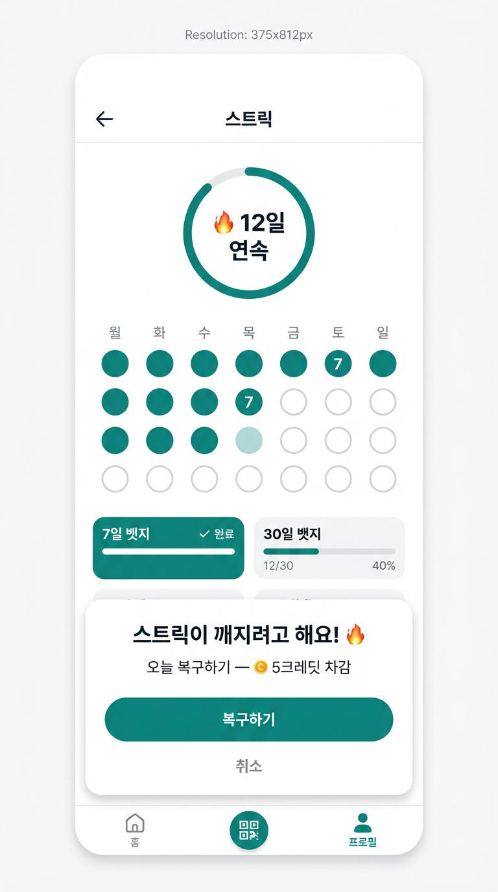  <!-- streak-detail 이미지 사용 중 — 응원폭탄 전용 시안 미제작 -->

---

## 화면 29 [Phase 2]: 직무 MBTI 카드 생성

> 🔗 이 화면은 화면 10(MBTI 카드 공유) 앞단입니다.

### 시나리오

이취준이 면접 3회 완료 후 직무 MBTI 카드 생성 화면에 진입한다. 분석 로딩 후 카드가 생성된다.

### 목적

바이럴 카드 생성 경험 + SNS 공유 유도

### 핵심 요소

- 4축 분석 진행 바 순차 채워짐 (3초 루프)
- 최대 10회 반복 (30초) 후 실패 처리
- 30초 초과 → A3 에러 상태("카드를 만들지 못했어요")
- 완료 시 카드 reveal 모션
- SNS 공유용 1:1 비율 카드

```
분석 로딩 (정상):
┌─────────────────────┐
│                     │
│  직무 MBTI 분석 중  │
│                     │
│  논리력  ████░░  80%│  ← Teal 진행 바
│  압박 대응 ██░░░  40%│
│  커뮤니케 ███░░  60%│
│  문제해결 █████ 100%│
│                     │
│  잠깐이요, 분석 중  │
│  이에요... (3초×N회)│
│                     │
└─────────────────────┘
```

```
타임아웃 실패 (30초 초과):
┌─────────────────────┐
│  ⚠ 카드를 만들지   │
│    못했어요         │
│                     │
│  면접 데이터가 부   │
│  족하거나 서버 오류  │
│  예요               │
│                     │
│ ┌─────────────────┐ │
│ │  다시 시도하기   │ │
│ └─────────────────┘ │
│  홈으로 →           │  ← 텍스트 링크
└─────────────────────┘
```

```
카드 생성 완료:
┌─────────────────────┐
│  냉철한 논리파      │
│  팩트 기반 명확형   │
│                     │
│  강점: 수치 기반    │
│         명확한 근거  │
│  약점: 감성적 공감  │
│         다소 부족    │
│                     │
│  [1:1 SNS 카드]     │  ← → 화면 10
│ ┌─────────────────┐ │
│ │  공유하기 →      │ │
│ └─────────────────┘ │
└─────────────────────┘
```

### 진입 params

`{ userId }` (면접 데이터 참조용)

### 이탈 params

생성 완료 → 화면 10(MBTI 카드 공유); 실패 → 재시도 or 홈(화면 2)

### 상태 변형

- 면접 데이터 부족 (3회 미만): '아직 데이터가 부족해요. 면접을 3회 완료하면 카드를 만들 수 있어요!' 안내 + '지금 면접하기 →' CTA → 화면 12로 이동. A3(타임아웃 오류)와 별개 상태.
- 분석 로딩: 4축 진행 바 순차 채움
- 타임아웃(30초 초과): 에러 상태 + 재시도/홈 복귀
- 생성 완료: 카드 reveal + 공유 CTA

### 시안 이미지

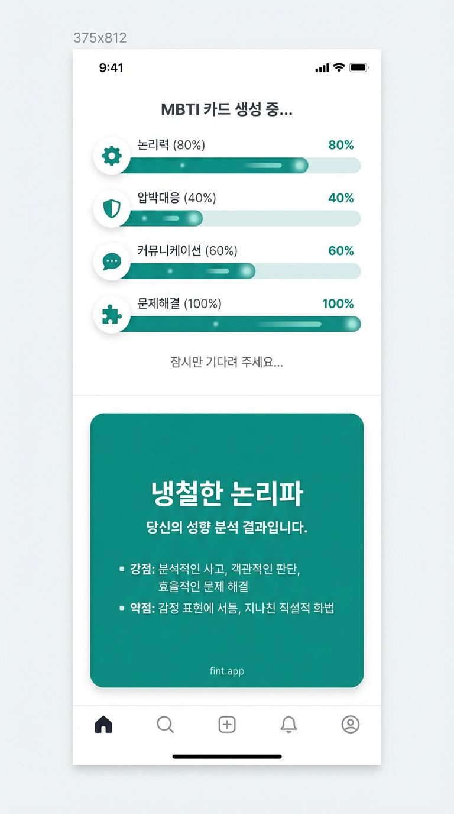

---

## 화면 30 [Phase 2]: 취준생→현직자 전환 온보딩

### 시나리오

이취준(이제 취업 성공)이 프로필 탭에서 "현직자로 등록하기"를 탭한다. 전환 안내 모달이 표시된다.

### 목적

취준생 → 현직자 전환 UX + 기존 데이터 유지 안내

### 핵심 요소

- 전환 안내 모달: 기존 취준생 데이터(면접 히스토리, 배지) 유지 확인
- "확인 후 등록" → 화면 27(현직자 온보딩) 연결
- 취소 → 화면 18(프로필 탭) 복귀

```
전환 안내 모달:
┌─────────────────────┐
│  [배경 딤]          │
│ ┌─────────────────┐ │
│ │  현직자로 전환   │ │
│ │                  │ │
│ │  기존 면접 기록  │ │
│ │  과 배지는 그대  │ │
│ │  로 유지됩니다   │ │
│ │                  │ │
│ │  현직자 등록 후  │ │
│ │  추가 수익을 얻  │ │
│ │  을 수 있어요!   │ │
│ │                  │ │
│ │ ┌─────────────┐  │ │
│ │ │  등록 시작   │  │ │  ← Teal → 화면 27
│ │ └─────────────┘  │ │
│ │    취소            │ │  ← → 화면 18 복귀
│ └─────────────────┘ │
└─────────────────────┘
```

### 진입 params

`{ from: 'seeker_profile', userId }`

### 이탈 params

"등록 시작" → 화면 27 `{ from: 'seeker_profile', userId }`; 취소 → 화면 18

### 상태 변형

- 기본: 전환 안내 모달 표시
- "등록 시작" 탭: 화면 27 진입
- "취소" 탭: 화면 18 복귀
- Android 뒤로가기 버튼 또는 스와이프 다운 → '취소' 동작과 동일 (화면 18 복귀).

### 시안 이미지

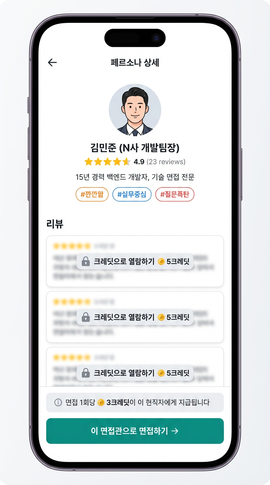  <!-- 전환모달 전용 시안 미제작 -->

---

## 화면 31 [Phase 2+]: 연봉 통계/이직 타이밍 분석

> 현직자 전용 화면. **최현직 페르소나** 시나리오.

### 시나리오

최현직이 프로필 탭에서 "연봉 통계" 메뉴를 탭한다. 자신의 직군(개발) 연봉 분포와 이직 적정 시기를 확인한다.

### 목적

현직자 전용 프리미엄 콘텐츠로 리텐션 강화

### 핵심 요소

- 직군별 연봉 분포: 범위 바 차트 (min-median-max, horizontal). 데이터 포인트: 최솟값, 25퍼센타일, 중앙값(●), 75퍼센타일, 최댓값. 차트 라벨: type-caption color-text-secondary, 수치 type-body weight 600 color-text-primary.
- 이직 적정 시기 분석 (개인 연차 기반)
- 잠금 콘텐츠: 크레딧 소비로 상세 열람
- 최현직 페르소나 뷰

```
Happy Path (최현직 뷰):
┌─────────────────────┐
│  ← 연봉 통계        │
│─────────────────────│
│ 개발 · 5년차 기준   │
│─────────────────────│
│ 연봉 분포           │
│ [====●====] 5500만  │  ← 범위 바 차트 (color-primary 내 위치 마커 ●)
│ 하위 상위           │
│ 3500  8000          │
│─────────────────────│
│ 이직 적정 시기      │
│ ┌─────────────────┐ │
│ │ 🔒 상세 분석 보기│ │  ← 크레딧 잠금
│ │ 🪙 CREDIT_      │ │
│ │    ANALYTICS_VIEW│ │
│ └─────────────────┘ │
└─────────────────────┘
```

### 진입 params

`{ userId }` (현직자 인증 필요)

### 이탈 params

뒤로 → 화면 18(프로필)

### 상태 변형

- 크레딧 충분: 상세 분석 언락
- 크레딧 부족: 잠금 상태 + 충전 CTA (→ 화면 20)
- 비인증 현직자: '인증 완료 후 이용 가능해요' + '[인증 완료하기 →]' (→ 화면 27 재진입) 오버레이. 기본 통계(중앙값/평균) 블러 처리.

### 시안 이미지

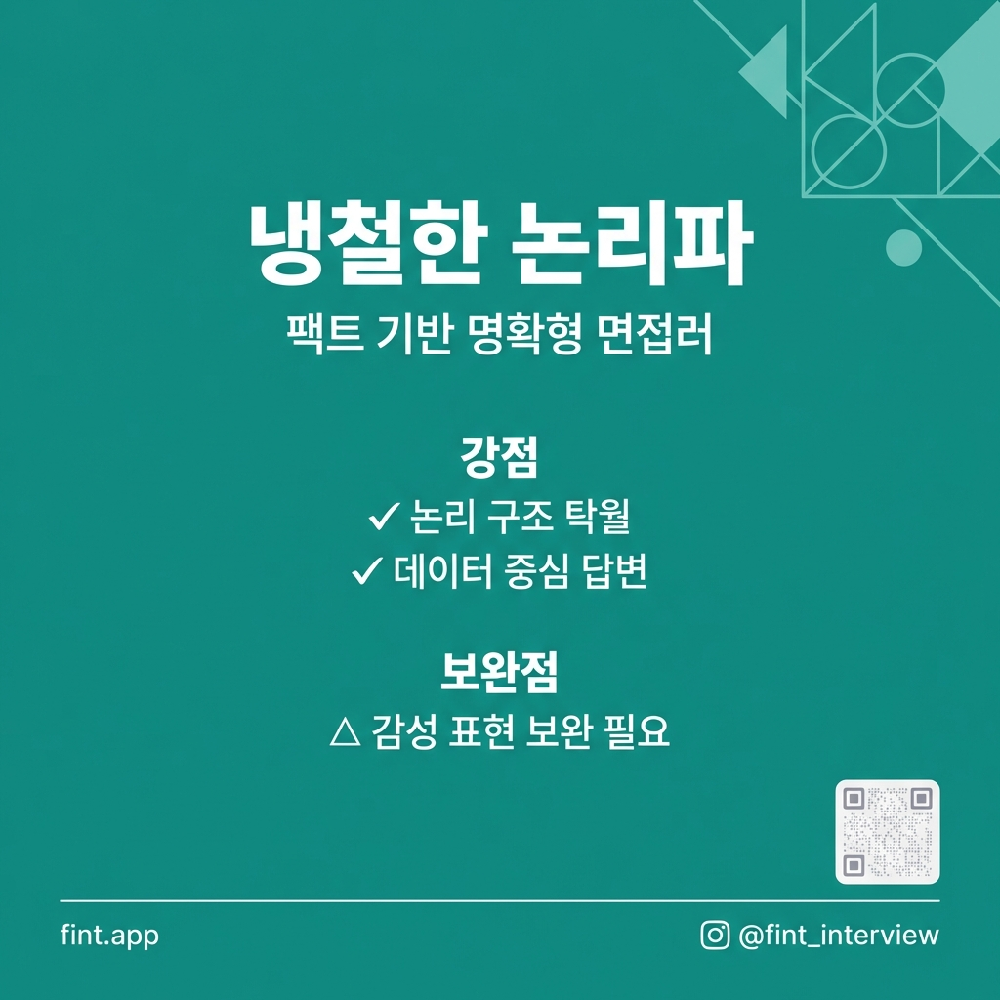  <!-- mbti-card 이미지 사용 중 — 연봉통계 전용 시안 미제작 -->

---

## 화면 간 Navigation Params

| 전환 | 진입 params | 비고 |
|------|------------|------|
| 채팅면접 종료 → 결과 리포트 | `reportId`, `sessionId` | |
| 페르소나 마켓 상세 → 채팅면접 | `personaId`, `personaName` | |
| 크레딧 부족 → 게이트 모달 | `requiredCredits: number`, `currentCredits: number`, `returnTo: RouteString` | Bottom sheet. 결제 실패 후 재진입 시 `currentCredits` 서버 재조회 필수 |
| 게이트 모달 → 크레딧 충전 | `from: 'gate'`, `returnTo: RouteString` | |
| 로그인 완료 → 이전 화면 | `redirect` query param | |
| 면접 설정 → AI 면접관 선택 | `difficulty`, `duration`, `language` | |
| AI 면접관 선택 → 채팅면접 | `personaId`, `difficulty`, `duration` | |
| 후기 작성 완료(화면 17) → 커뮤니티 탭(화면 24) | (없음, 탭 전환) | 후기 작성 후 "커뮤니티에서 보기" 선택 시 |
| 취준생→현직자 전환(화면 30) → 현직자 온보딩(화면 27) | `from: 'seeker_profile'`, `userId` | 전환 취소 시 화면 18(프로필 탭) 복귀 |
| 알림 센터(화면 26) → 딥링크 대상 | `deeplink: {type, targetId}` | 타입별: streak→면접시작, credit→크레딧내역, dm→쪽지상세, level_up→배지섹션 |
| OAuth 콜백 → returnTo 복귀 | `state` (OAuth CSRF token), `redirect` | OAuth 실패 시 로그인 화면 복귀 + 에러코드 표시 |
