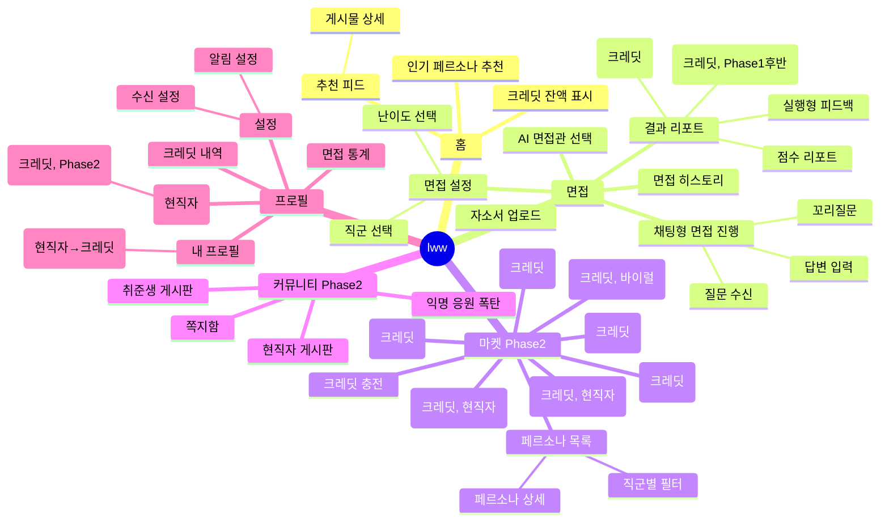

# Fint — IA(정보 구조) & 화면 플로우 명세

> 최종 수정: 2026-03-16
> 담당: 브랜딩·기획 팀

---

## 서비스 개요

| 항목 | 내용 |
|------|------|
| 서비스명 | lww (Life With Work) |
| 슬로건 | "취업준비부터 직장생활까지, 재밌게" |
| 핵심 기능 | 모바일 AI 모의면접 + 커뮤니티 |
| 레퍼런스 UI | LinkedIn(프로필), 당근마켓(채팅·커뮤니티), 블라인드(익명 게시판) |
| 기준 해상도 | 375px (모바일 우선) |
| 주요 사용자 | 취준생, 현직자 |

---

## 1. IA 전체 구조

하단 탭 네비게이션 5개 탭 기준으로 계층화.

```
lww
├── 홈 (피드)
│   ├── 추천 피드
│   │   └── 게시물 상세
│   ├── 인기 페르소나 추천
│   └── 크레딧 잔액 표시
│
├── 면접 (AI 모의면접)
│   ├── 자소서 업로드
│   ├── 면접 설정
│   │   ├── 직군 선택
│   │   └── 난이도 선택
│   ├── AI 면접관 선택 (페르소나 마켓 진입점)
│   ├── 채팅형 면접 진행
│   │   ├── 질문 수신
│   │   ├── 답변 입력
│   │   └── 꼬리질문
│   ├── 결과 리포트
│   │   ├── 점수 리포트
│   │   ├── 실행형 피드백
│   │   ├── 합격 예언 오브 (크레딧 소비, Phase 1 후반)
│   │   ├── 고득점 Q&A 패턴 열람 (크레딧 소비, Phase 1 후반)
│   │   └── 면접 후기 작성 CTA (크레딧 획득, Phase 1)
│   └── 면접 히스토리
│
├── 마켓 (Phase 2)
│   ├── 페르소나 목록
│   │   ├── 직군별 필터
│   │   └── 페르소나 상세
│   ├── 면접 후기 (크레딧 소비)
│   ├── 아차 포인트 (크레딧 소비)
│   ├── 회사 평가 (크레딧 소비)
│   ├── 연봉 통계 열람 (크레딧 소비, Phase 2)
│   ├── 이직 타이밍 분석 (크레딧 소비, 현직자용, Phase 2)
│   ├── 동료 스카우트 후기 (크레딧 소비, 현직자용, Phase 2)
│   ├── 직무 MBTI 카드 (크레딧 소비, 바이럴 콘텐츠, Phase 2)
│   ├── 오늘의 면접 운세 (크레딧 소비, Phase 2)
│   └── 크레딧 충전
│
├── 커뮤니티 (Phase 2)
│   ├── 취준생 게시판
│   ├── 현직자 게시판
│   ├── 익명 응원 폭탄 보내기
│   └── 쪽지함
│
└── 프로필
    ├── 내 프로필
    │   └── [현직자 전용] 연봉·직군·연차 입력 → 크레딧 지급
    ├── 면접 통계
    ├── 크레딧 내역
    ├── 설정
    │   ├── 수신 설정 (응원폭탄 옵트아웃)
    │   └── 알림 설정
    └── [현직자 전용] 내 페르소나 관리
        └── 내 페르소나 통계 열람 (크레딧 소비, Phase 2)
```

### Mermaid 마인드맵



---

## 2. 온보딩 플로우 — 취준생

### 플로우 다이어그램

```mermaid
flowchart TD
    A([앱 실행]) --> B[스플래시 화면\n\"오늘의 면접, 시작해볼까요?\"]
    B --> C[서비스 소개 슬라이드\n3장 스와이프]
    C --> F[프로필 설정 1화면\n직군 선택 + 취준 단계\n동시 입력]
    F --> H[자소서 업로드\nPDF·HWP·DOC — 선택 사항\nPhase 1부터 제공]
    F -- MVP 경로\n자소서 없이 바로 --> I
    H --> I[\"첫 면접 시작해볼까요?\" CTA]
    I --> J[채팅형 면접 진행\nAI 면접관 기본 3종 중 1개]
    J --> K[결과 리포트\n★ Aha Moment]
    K --> L[가입 유도 CTA\n\"결과를 저장하려면 로그인하세요\"\nPhase 1 소셜 로그인 연결]
    L --> L2{로그인 여부}
    L2 -- 로그인 완료 --> M([홈 피드 진입])
    L2 -- 나중에 --> M
    K -. Phase 1부터 .-> KK[🪙 크레딧 N개 획득\n\"첫 면접 완료 보상!\"\n수량 미확정\n⚠️ Phase 1 전용 — MVP 미포함]
    KK --> L

    style K fill:#fffbe6,stroke:#f5a623
    style H fill:#f6ffed,stroke:#52c41a,stroke-dasharray:4
    style L fill:#fff0f6,stroke:#eb2f96,stroke-dasharray:4
    style KK fill:#e6f7ff,stroke:#1890ff,stroke-dasharray:4
```

### 단계별 UX 분석

| 단계 | 이탈 원인 | 해결책 |
|------|-----------|--------|
| 스플래시 | 서비스가 뭔지 모름 | 슬로건 + 핵심 가치 3줄 요약 |
| 서비스 소개 슬라이드 | 슬라이드가 길어서 스킵 충동 | 3장 이내, 스킵 버튼 제공 |
| 직군 선택 | 선택지 과다 | 인기 직군 상단 노출, 검색 지원 |
| 자소서 업로드 | 파일 없거나 귀찮음 | "나중에 하기" 옵션 명시, 혜택 안내 |
| 채팅형 면접 진행 | 어색함·두려움 | 연습 모드 느낌 강조, 부드러운 AI 말투 |
| **결과 리포트** | — | **★ Aha Moment: 내 면접 점수 + 맞춤 피드백 최초 확인** |
| 크레딧 획득 | — | 보상 애니메이션으로 도파민 설계 |

---

## 3. 온보딩 플로우 — 현직자

### 플로우 다이어그램

```mermaid
flowchart TD
    A([랜딩 페이지]) --> B[소셜 로그인]
    B --> C{계정 유형 선택}
    C -- 취준생 --> Z([취준생 온보딩])
    C -- 현직자 --> D[\"현직자로 활동하기\" 선택]
    D --> E[회사 인증]
    E --> E1[이메일 인증\n회사 도메인 @company.com]
    E --> E2[재직증명서 업로드\n보조 인증 수단]
    E1 --> F[직군·연차 설정]
    E2 --> F
    F --> G[페르소나 제작 안내\n\"내 면접 스타일을 AI로 만들어요\"]
    G --> H[첫 페르소나 등록\n이름·직군·스타일·말투 설정]
    H --> I[\"내 페르소나가 이제 살아서 활동해요!\" 완료 화면]
    I --> J[🪙 현직자 가입 보너스 크레딧 지급]
    J --> K([홈 피드 진입])

    style I fill:#fffbe6,stroke:#f5a623
    style J fill:#e6f7ff,stroke:#1890ff
```

### 단계별 UX 분석

| 단계 | 이탈 원인 | 해결책 |
|------|-----------|--------|
| 현직자 선택 | 혜택 불명확 | "내 경험이 취준생에게 실제 도움이 됐대 — 재밌지 않아?" (재미·보람 강조, 크레딧은 2순위) |
| 회사 인증 | 번거로움 | 이메일 인증 우선 제공, 재직증명서 업로드 보조 옵션 |
| 직군·연차 설정 | 세분화 부담 | 대분류만 필수, 소분류 선택. 🪙 연봉·직군·연차 상세 입력 시 크레딧 지급 (Phase 2 활동 보상) |
| 페르소나 제작 | 뭘 입력할지 모름 | 예시 템플릿 3종 제공 |
| **완료 화면** | — | **★ Aha Moment: 내 AI 분신이 취준생들을 면접하는 모습 시각화** |

---

## 4. 취준생 → 현직자 전환 플로우

```mermaid
flowchart TD
    A([합격 후기 작성]) --> B[🪙 크레딧 지급\n🎉 축하 화면 팝업]
    B --> C[\"이제 현직자로 활동해보세요\"\n배너 프롬프트 노출]
    C --> D{전환 선택?}
    D -- 나중에 --> E([기존 취준생 홈])
    D -- 전환하기 --> F[회사 인증]
    F --> G[현직자 프로필 전환]
    G --> H[페르소나 제작 온보딩]
    H --> I[첫 페르소나 완료]
    I --> J[🪙 전환 보너스 크레딧 지급\n\"첫 페르소나 등록 완료!\"]
    J --> K([현직자 홈 피드])

    style B fill:#fffbe6,stroke:#f5a623
    style J fill:#e6f7ff,stroke:#1890ff
```

---

## 5. 핵심 화면 플로우 (Task 기반)

### Task 1: 첫 모의면접 완료 (Phase 1 핵심 플로우)

```mermaid
flowchart TD
    A([면접 탭 진입]) --> B{자소서 있음?}
    B -- 없음 --> C[자소서 업로드 유도\n스킵 가능]
    B -- 있음 --> D[면접 설정]
    C --> D
    D --> D1[직군 선택]
    D1 --> D2[난이도 선택\n기초·보통·심화]
    D2 --> E[AI 면접관 선택\n기본 3종]
    E --> F[채팅형 면접 시작]
    F --> F1[AI 질문 수신]
    F1 --> F2[사용자 답변 입력]
    F2 --> F3{꼬리질문?}
    F3 -- Yes --> F1
    F3 -- No / 질문 5개 완료 --> G[면접 종료]
    G --> H[결과 리포트\n점수·피드백]
    H --> I{합격 예언 오브?}
    I -- 크레딧 사용 --> J[합격 예언 오브 열람\n\"당신의 면접 준비도 분석\"]
    I -- 패스 --> K[면접 히스토리 저장]
    J --> K
    K --> L[🪙 크레딧 획득]
    L --> M([홈 피드 or 재도전])
```

### Task 2: 현직자에게 쪽지 보내기 (Phase 2)

```mermaid
flowchart TD
    A([커뮤니티 or 페르소나 상세]) --> B[현직자 프로필 조회]
    B --> C[\"쪽지 보내기\" 버튼]
    C --> D{크레딧 충분?}
    D -- 부족 --> E[크레딧 부족 안내\n\"면접 완료하면 크레딧 받아요\"]
    E --> F([면접 탭으로 이동])
    D -- 충분 --> G[쪽지 작성\n최대 300자]
    G --> H[발송 확인 팝업\nN크레딧 차감 안내]
    H --> I{발송 확인}
    I -- 취소 --> G
    I -- 확인 --> J[쪽지 발송 완료\n🪙 크레딧 차감]
    J --> K[쪽지함에서 답장 대기]
    K --> L{답장 수신?}
    L -- Yes --> M[푸시 알림\n쪽지함 뱃지]
    L -- No / 3일 경과 --> N[\"답장이 없어요. 다른 현직자에게도 물어보세요!\"]
```

### Task 3: 페르소나 마켓에서 페르소나 선택 후 면접 (Phase 2)

```mermaid
flowchart TD
    A([마켓 탭 진입]) --> B[페르소나 목록]
    B --> C[직군별 필터 적용]
    C --> D[페르소나 상세 조회\n현직자 정보·스타일·후기]
    D --> E{면접 후기 확인?}
    E -- 크레딧 사용 --> F[면접 후기 열람]
    E -- 패스 --> G[\"이 면접관으로 면접하기\" CTA]
    F --> G
    G --> H[면접 설정\n직군·난이도]
    H --> I[채팅형 면접 진행\n해당 페르소나 말투·스타일 적용]
    I --> J[결과 리포트]
    J --> K[🪙 크레딧 획득\n현직자에게 크레딧 분배]
```

### Task 4: 아차 포인트 크레딧으로 잠금 해제 (Phase 2)

```mermaid
flowchart TD
    A([결과 리포트 or 마켓]) --> B[아차 포인트 잠금 상태 확인\n\"내가 놓친 포인트 N개\"]
    B --> C[\"크레딧으로 잠금 해제\" 버튼]
    C --> D{크레딧 충분?}
    D -- 부족 --> E[크레딧 획득 유도\n면접 완료 or 충전]
    D -- 충분 --> F[잠금 해제 확인 팝업\nN크레딧 차감 안내]
    F --> G{확인}
    G -- 취소 --> B
    G -- 확인 --> H[아차 포인트 열람\n\"이 답변에서 이렇게 했으면 더 좋았어요\"]
    H --> I[관련 모범 답안 링크]
    I --> J{재면접?}
    J -- Yes --> K([면접 설정 화면])
    J -- No --> L([결과 리포트 메인])
```

---

## 6. Phase별 화면 출시 순서

| Phase | 포함 화면 | 목표 |
|-------|-----------|------|
| **MVP** | 면접 탭 전체 (면접 설정, 채팅형 면접, 결과 리포트, 면접 히스토리) + 프로필 기본 (직군 선택) | 핵심 루프 검증: 면접 → 결과 |
| **Phase 1** | 자소서 업로드 + 크레딧 획득 + 스트릭·레벨업 | 개인화·리텐션 루프 검증 |
| **Phase 1 후반** | 합격 예언 오브 + 고득점 Q&A 패턴 열람 (크레딧 소비) | 리텐션 강화 (크레딧 소비처 오픈) |
| **Phase 2+3** | 홈 피드 + 커뮤니티 (취준생·현직자 게시판) + 마켓 (페르소나 목록·상세) + 쪽지 + 현직자 크레딧 소비처 (연봉 통계·이직 타이밍 분석·동료 스카우트 후기) + 직무 MBTI 카드 + 응원 폭탄 + 채용 매칭 탭 + 기업 직접 연결 기능 | 커뮤니티·네트워크 효과 + 수익화 (마감: 2026-04-01) |

---

## 참고

- 이 문서는 `docs/specs/lww/content_spec.md` (마이크로카피·톤 가이드)와 함께 사용한다.
- 와이어프레임 및 프로토타입은 별도 Figma 링크 참조.
- Phase 2 이상 화면은 기획 확정 후 별도 IA 업데이트 예정.
