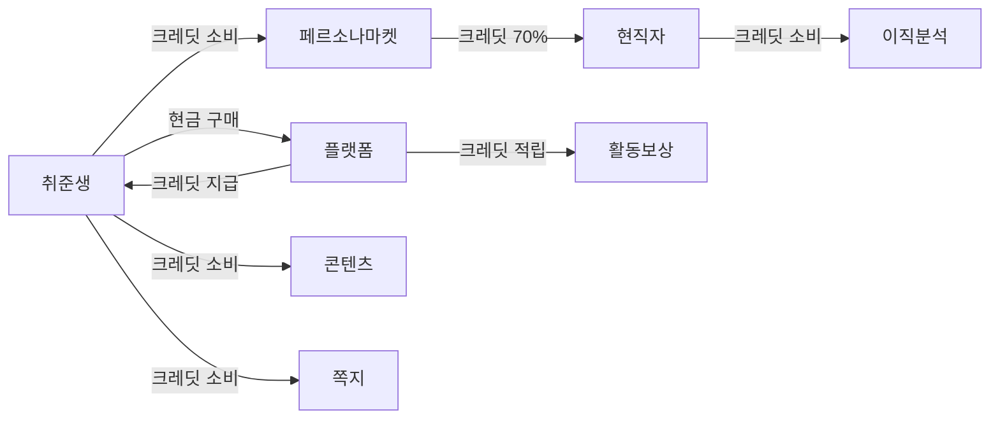
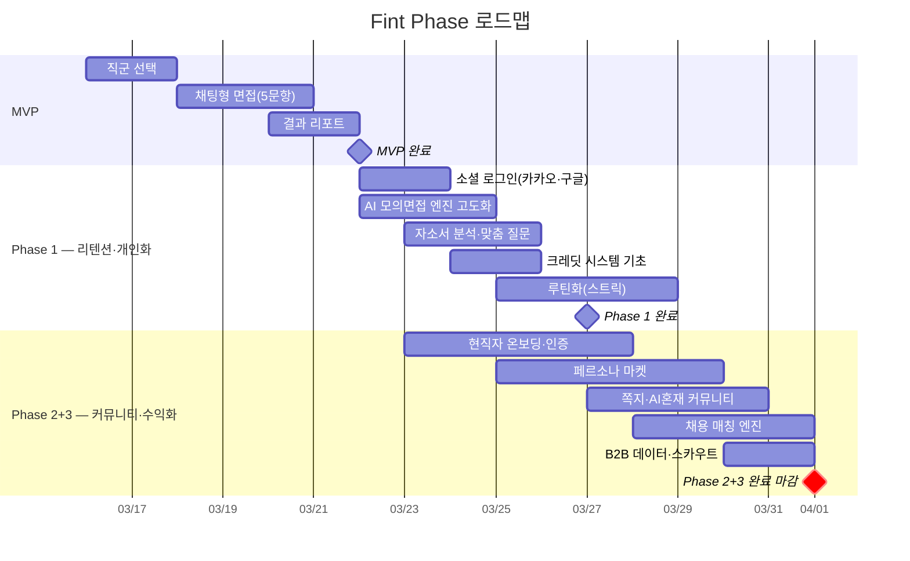
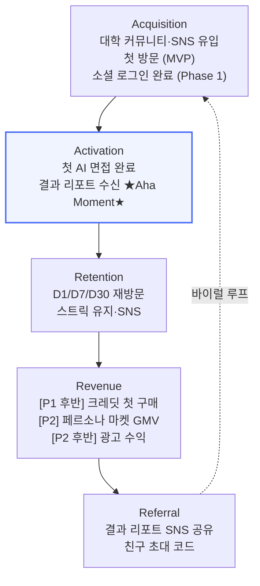
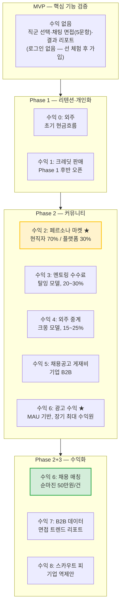

# Fint 서비스 기획서

> "커리어를 재밌게"

---

## 목차

1. [서비스 개요](#1-서비스-개요)
2. [시장 규모](#2-시장-규모)
3. [경쟁사 포지셔닝](#3-경쟁사-포지셔닝)
4. [수익 모델](#4-수익-모델)
5. [KPI & NSM](#5-kpi--nsm)
6. [AARRR 퍼널](#6-aarrr-퍼널)
7. [유닛 이코노믹스](#7-유닛-이코노믹스)
8. [로드맵](#8-로드맵)
9. [콜드 스타트 전략](#9-콜드-스타트-전략)
10. [AI 에이전트 생태계 비전](#10-ai-에이전트-생태계-비전)
11. [다이어그램](#11-다이어그램)

---

## 1. 서비스 개요

### 서비스명
Fint (Find Interview — 면접을 찾아서)

### 핵심 슬로건
> **"커리어를 재밌게"**

### 포지셔닝
**"Duolingo for 면접"** — 지루하고 무겁고 비싼 면접 준비를, 가볍고 재밌게 바꾸는 서비스.

언어 학습 앱 Duolingo가 일상 루틴으로 영어를 습관화했듯이, Fint는 모바일 SNS UI와 스트릭 메커니즘으로 면접 준비를 일상 루틴으로 만든다. 취준생과 현직자가 함께 소통하는 양면 커리어 플랫폼으로, 구직자는 현직자의 경험을 배우고 현직자는 자신의 노하우로 가치를 만든다.

### 3대 페인포인트

| # | 페인포인트 | 현황 |
|---|-----------|------|
| ① | **돈없음** | 유료 면접 컨설팅 1회 30~40만원, 취준생 대다수 엄두도 못 냄 |
| ② | **지루함** | 기존 면접 준비 방식(모범 답안 암기, 녹화 자가분석)은 재미없음 |
| ③ | **외로움** | 취업 준비 기간 평균 11.5개월, 혼자 보내며 현직자와 연결될 방법이 없다 |

### 가치 제안 한 문장

> **"모바일 채팅 한 판으로, 가볍게, 매일 면접 준비"**

취준생은 모바일 SNS UI로 AI 면접관(또는 현직자 페르소나)과 채팅 형식의 모의면접을 진행하고, 즉시 피드백 리포트를 받는다. 크레딧을 활용해 부담 없이 반복 연습하며, 재밌는 콘텐츠와 스트릭으로 동기부여를 유지한다. 현직자는 피드에서 활동하다 자연스럽게 멘토링·헤드헌팅으로 수익을 창출한다.

### 양면 소셜 네트워크

Fint는 AI 면접 도구에 그치지 않고, **취준생과 현직자가 함께 활동하는 소셜 네트워크**다. 인스타그램처럼 피드·프로필·쪽지로 구성되지만, 커리어 맥락에 특화돼 있다.

#### 프로필
- 취준생·현직자 모두 개인 커리어 프로필 보유
- 표시 항목: 직군, 경력, 재직 회사(현직자), 면접 점수·뱃지(취준생), 보유 크레딧
- 현직자 프로필에는 AI 페르소나 활성화 여부 표시 → 취준생이 직접 모의면접 신청 가능

#### 피드
- 인스타그램과 유사한 타임라인 피드
- 올릴 수 있는 콘텐츠: 면접 후기, 합격 인증, 커리어 팁, AI 면접 결과 리포트 카드 공유
- 취준생·현직자·AI 페르소나가 함께 피드에 활동 → 콘텐츠 공급 부족 문제 해결
- 기업은 스폰서드 콘텐츠(채용 공고)를 피드에 삽입 → 광고 수익원

#### 1:1 쪽지
- 취준생이 현직자에게 직접 쪽지 발송 (크레딧 소모)
- 현직자는 수신함에서 쪽지 확인 후 응답 → 멘토링으로 전환 가능
- 크레딧 소모 구조로 무분별한 스팸 방지, 진지한 연결만 유도
- 쪽지 → 유료 화상 멘토링 → 수수료 수익으로 자연스럽게 이어짐

| 기능 | 취준생 | 현직자 |
|------|--------|--------|
| **프로필** | 직군·면접 성적·뱃지 | 경력·재직사·AI 페르소나 |
| **피드** | 후기·리포트 공유 | 커리어 팁·채용 정보 공유 |
| **쪽지** | 현직자에게 발송 (크레딧 소모) | 수신 후 멘토링 전환 |
| **수익** | 취업 성공 | 멘토링·헤드헌팅 수수료 |

이 구조가 "외로운 취준"을 "함께하는 커리어"로 바꾸는 핵심이다. 블라인드가 익명 기반의 현직자 커뮤니티라면, Fint는 실명·커리어 기반의 취준생·현직자 양면 네트워크다.

---

## 2. 시장 규모

### 핵심 수치 근거

| 지표 | 수치 | 출처 |
|------|------|------|
| 공식 취업시험 준비자 (15~29세) | **56만 5,000명** | 통계청, 2024년 5월 경제활동인구조사 청년층 부가조사 |
| 청년 '쉬었음' 인구 | **46만 9,000명** | 통계청, 2026년 1월 |
| 취업준비 평균 기간 | **11.5개월** (역대 최장) | 한국경제인협회 |
| 월 취업준비 평균 지출 | **35만원/월** (2021) → 물가 반영 추정 **40~50만원** | 캐치 설문, 2021 |

### TAM (Total Addressable Market)

**국내 취업준비생 + 이직 준비자 약 100만명 이상**

- 공식 취준생 56.5만 + 청년 쉬었음(구직 포기 포함) 46.9만의 교집합 제외분 + 현직자 중 이직 준비 인구 (~30만 추정)
- 연간 면접 준비 지출 총액: 100만명 × 40만원 × 평균 활동 기간 환산 = 수천억 원 규모 시장
- 한국 면접 준비 및 커리어 코칭 시장: 연 약 3,000억~5,000억원 추정 [가설] (유료 컨설팅 + 인강 + 플랫폼 수수료 포함 — 공식 출처 없음, 취준생 지출 단가 × 인구 역산)

### SAM (Serviceable Addressable Market)

**모바일 면접 준비 앱에 관심 있는 2030 약 40만명**

- 15~34세 스마트폰 보유율 99% 이상 (과학기술정보통신부, 2023)
- 취업 관련 모바일 앱 이용 경험률: 취준생의 약 60~70% (추정)
- SAM = TAM 100만 × 모바일 앱 수용성 40% [가설] = **약 40만명**

### SOM (Serviceable Obtainable Market)

**Phase 1 목표: MAU 25,000명**

- 전체 TAM의 2.5% 점유 (100만명 × 2.5%)
- 초기 확보 채널: 대학 커뮤니티(에브리타임), 취업 카페, SNS 바이럴
- MAU 25,000명 × ARPU ₩1,000~₩5,000 (Phase 1 후반 크레딧 판매 오픈 이후 기준 [가설]) = 월 매출 2,500만~1억 2,500만원 잠재

---

## 3. 경쟁사 포지셔닝

### 핵심 경쟁 구도 — 3대 경쟁자

Fint가 실질적으로 경쟁하는 서비스는 세 곳이다. 각각 다른 축에서 Fint의 포지션을 위협한다.

| 서비스 | 취준생 접근성 | 현직자 소통 | 재밌는 콘텐츠 | AI 활용 | 핵심 한계 | Fint 대응 |
|--------|------------|------------|------------|--------|---------|---------|
| **사람인 AI 면접** | ✅ 높음 (앱 MAU 644만) | ❌ 없음 | ❌ 없음 | ✅ 화상면접 AI 분석 | 1회 1만원 고비용, 반복 유인 없음, 현직자·콘텐츠 없음 | 크레딧 반복 + 양면 소셜 + 재밌는 콘텐츠 |
| **블라인드** | ❌ 취준생 소외 | ✅ 있음 (가입자 800만) | ✅ 커뮤니티 콘텐츠 | ❌ 없음 | 취준생 진입 장벽, 면접 훈련 없음, AI 없음 | 실명·커리어 기반 + AI 면접 + 취준생 포용 |
| **LinkedIn** | ✅ 있음 (글로벌) | ✅ 있음 (채용 네트워킹) | ❌ 없음 | ❌ 없음 | 한국 취준생 문화 미스핏, 딱딱함, 재밌는 콘텐츠·AI 없음 | 한국 취준생 친화적 + 면접 특화 + 재밌는 콘텐츠 + AI |
| **Fint** | ✅ | ✅ | ✅ | ✅ | — | — |

**Fint의 포지션**: 취준생 접근성 ✅ + 현직자 소통 ✅ — 이 조합을 가진 서비스가 현재 없다.

### 경쟁사 비교표 (전체)

| 서비스 | 타겟 | 과금 방식 | MAU/규모 | 핵심 기능 | 한계 |
|--------|------|-----------|----------|-----------|------|
| **사람인 AI 면접** | 취준생 | 10,000원/회 | 앱 MAU 644만 (플랫폼 전체, 2025년 1~4월) | 화상 면접 시뮬레이션, AI 분석 | 1회성 고비용, 반복 유인 없음 |
| **블라인드** | 직장인 | 무료/광고 | 가입자 800만, MAU 920만 (2023년, 한국+미국, 자사 주장¹) | 익명 직장인 커뮤니티 | AI·사람 혼재 불분명, 취준생 소외 |
| **LinkedIn** | 프로페셔널 전반 | 프리미엄 구독 | 미공개 (국내) | 채용 네트워킹, 프로필 | 국내 취준생 사용성 낮음, 딱딱함 |
| **뷰인터** | 기업(B2B) | B2B 구독 | 미공개 (도입 기업 33개+) | 화상 면접 녹화 + AI 분석 | 취준생 직접 접근 어려움 |
| **잡다** | 취준생 | 무료/부분유료 | 인재풀 60만, 기업 2,100개 (2023년) | 역량검사 + 채용 매칭 | 면접 훈련 기능 부재 |
| **잡플래닛** | 직장인/취준생 | 무료/광고 | 앱 MAU ~150만 (2025년, 잡코리아 인수) | 기업 평가·연봉 정보 | 면접 훈련 없음 |
| **Fint** | 취준생·이직자·현직자 멘토 | 크레딧 + 광고 | — (목표 MAU 25,000) | AI 면접, 재밌는 콘텐츠·크레딧, 구직자·현직자·AI 통합 SNS, 자연 수익화 | — |

### Fint 차별점

| # | 차별점 | 내용 |
|---|--------|------|
| ① | **콘텐츠·크레딧** | 재밌는 콘텐츠로 일상 루틴화, 크레딧으로 부담 없이 서비스 이용 |
| ② | **구직자·현직자·AI 통합 SNS** | 각자 프로필 보유, 피드에서 소통, 1:1 쪽지 연결 |
| ③ | **자연스러운 수익화** | 구직자는 취업으로, 현직자는 멘토링·헤드헌팅으로 가치 창출 |

---

## 4. 수익 모델

### 레이어 구조

수익원은 **크레딧 경제(게임머니)** 기반과 **현금 직접 과금** 레이어로 분리된다.

```
[크레딧 경제 레이어]        [현금 과금 레이어]
크레딧 구매 (현금→크레딧)     멘토링 수수료
크레딧 획득 (활동 보상)     채용 매칭 수수료
크레딧 소비 (서비스 이용)   외주 중계 수수료
```

**크레딧 단가**: 1크레딧 ≈ 5,000원 [가설] (플랫폼 내부 단가. UI에서 원화 환산 직접 표시 지양 — 소비 심리 마찰 감소)

---

### 수익원 상세

#### [A] 크레딧 경제 (게임머니)
- 취준생이 크레딧을 현금으로 구매하거나 활동(면접 완료, 출석, 추천인 등)으로 획득
- 플랫폼 직접 매출: 크레딧 판매 수익
- 소비처: 페르소나 마켓 이용, 프리미엄 콘텐츠, 쪽지 발송

#### [B] 멘토링 중계 수수료 (현금)
- 탈잉·클래스101 모델
- 현직자 멘토가 1:1 화상 멘토링 상품을 등록, 취준생이 현금 결제
- 플랫폼 수수료: 거래액의 20~30%

#### [C] 채용 공고 게재 + 매칭 수수료 (현금)
- **채용 공고 게재비** (사람인·잡코리아 모델): 기업이 Fint에 채용 공고를 올릴 때 게재비 지불
  - Fint 취준생 풀은 면접 준비 중인 고의향 타겟 → 일반 구인 플랫폼 대비 전환율 높음
  - 건당 10~50만원 [가설]. Phase 2부터 도입
- **채용 매칭 수수료** (원티드 모델): 추천 알고리즘으로 매칭 → 채용 성사 시 수수료
  - 수수료: 기업 100만원 / 취준생 50만원 환급 → 플랫폼 순마진 50만원/건
  - Phase 2+3 핵심 수익원

#### [D] 현직자 외주 중계 (현금)
- 크몽·숨고 모델
- 현직자가 이력서 첨삭, 자소서 피드백, 포트폴리오 리뷰 등 단건 서비스 제공
- 플랫폼 수수료: 거래액의 15~25%

#### [E] 광고 수익 (Ad Revenue)
- **플랫폼 광고 수익은 유저 결제보다 규모가 크게 성장하는 경향** (LinkedIn·블라인드 사례 참고)
- MAU가 일정 규모 이상이 되면 광고가 핵심 수익원으로 전환됨 → Phase 2 후반부터 도입
- **광고 유형**:
  - **채용 공고 스폰서드** — 기업이 취준생 타겟으로 채용 공고를 상단 노출·피드 삽입 (CPM/CPC)
  - **교육·자격증 광고** — 자격증 학원·온라인 강의 플랫폼이 취준생 대상 광고 집행
  - **B2B 브랜디드 콘텐츠** — 기업 HR팀이 현직자 경험담 콘텐츠를 스폰서 형태로 게재
- **수익 구조**: MAU × 광고 노출 수 × CPM 단가. MAU 10만 기준 월 수천만원 수준 가능 [가설]

---

### ★ 수익 2 — 페르소나 마켓 (Phase 2 핵심)

현직자가 자신의 면접 스타일·기업 문화를 AI 페르소나로 제작·등록하고, 취준생이 크레딧을 지불해 해당 페르소나와 모의면접을 진행하는 마켓플레이스.

**매출 인식 구조**:
- 취준생이 크레딧 지불 → 현직자 70% / 플랫폼 30% 분배
- 현직자는 크레딧을 **플랫폼 내 재소비 전용** (현금화 불가 — 게임머니 원칙)
- 플랫폼 매출 인식: 취준생이 크레딧을 현금으로 구매하는 시점에 전액 인식. 현직자 배분분은 미지급 게임머니(부채)로 관리
- 플랫폼 수익: 크레딧 판매 수익 × 30% (수수료 제외 후 순수익)

---

### Phase별 수익원 활성화

| 수익 # | 수익원 | 활성 Phase | 비고 |
|--------|--------|------------|------|
| — | 해당 없음 | MVP | 핵심 기능 검증 (수익 없음) |
| 수익 0 | 외주 프로젝트 | Phase 1 | 초기 현금흐름 확보 |
| 수익 1 | 크레딧 판매 | Phase 1 후반 | 소비처 오픈 이후 구매 동기 발생 |
| 수익 2 | 페르소나 마켓 ★ | Phase 2 | 핵심 GMV |
| 수익 3 | 멘토링 수수료 | Phase 2 | |
| 수익 4 | 외주 중계 수수료 | Phase 2 | |
| 수익 5 | 채용 공고 게재비 | Phase 2 | 기업 B2B |
| 수익 6 | **광고 수익** ★ | Phase 2 후반 | MAU 기반 — 장기적으로 최대 수익원 |
| 수익 7 | 채용 매칭 수수료 | Phase 2+3 | 고단가 |
| 수익 8 | B2B 데이터 | Phase 2+3 | 면접 트렌드·직군별 분석 |
| 수익 9 | 스카우트 피 | Phase 2+3 | 기업 역제안 |

---

## 5. KPI & NSM

### Phase별 NSM (North Star Metric)

| Phase | NSM | 이유 |
|-------|-----|------|
| **Phase 1** | 주간 모의면접 완료 세션 수 (실제 인간 유저 기준) | 핵심 가치 전달 직접 측정. 봇/어뷰징 제외 필수 |
| **Phase 2** | 주간 쪽지·페르소나 면접 성사 건수 | 커뮤니티·현직자 네트워크 활성화 증거 |
| **Phase 2+3** | 월간 채용 매칭 성사 건수 | 수익화 완성도 측정 |

### Phase 전환 조건

#### Phase 1 → Phase 2 전환 기준
- MAU 25,000명 달성
- 주간 모의면접 완료 세션 5,000건/주 달성
- D7 리텐션 25% 이상

#### Phase 2+3 진입 기준
- 인증 현직자 2,000명 확보
- 쪽지 응답률 30% 이상 (48시간 기준) [가설 — 실측 후 재조정]
- 유료직업소개사업 등록 완료 (채용 수수료 합법화)

---

## 6. AARRR 퍼널

### Phase별 AARRR

| 단계 | MVP 핵심 이벤트 | Phase 1 핵심 이벤트 | Phase 2 핵심 이벤트 | Phase 2+3 핵심 이벤트 |
|------|----------------|---------------------|---------------------|---------------------|
| **Acquisition** | 대학 커뮤니티·SNS 유입, 첫 방문 (로그인 없음) | 소셜 로그인 완료, 추천인 코드 | 현직자 초대 캠페인, 추천인 코드 | 기업 파트너십, 스카우트 유입 |
| **Activation** | 첫 AI 면접 완료 + 결과 리포트 수신 (Aha Moment) | 자소서 분석 → 맞춤 질문 세션 | 페르소나 마켓 첫 구매 or 첫 쪽지 발송 | 채용 매칭 첫 지원 |
| **Retention** | 재방문 (로컬 기록 확인) | D1/D7/D30 재방문, 스트릭 유지 | 주간 쪽지 응답, 페르소나 재이용 | 월간 스카우트 수신·응답 |
| **Revenue** | 없음 (핵심 루프 검증) | Phase 1 후반: 크레딧 판매 오픈 예정 | 페르소나 마켓 GMV, 광고 수익, 멘토링 수수료 | 채용 수수료, B2B 데이터 판매 |
| **Referral** | 결과 리포트 카드 SNS 공유 | 친구 초대, 스트릭 배지 공유 | 현직자 페르소나 공유, 커뮤니티 바이럴 | 채용 성사 후기 공유 |

---

## 7. 유닛 이코노믹스

> **[가설]** 아래 수치는 벤치마크 기반 가설이며 실측 후 재조정 필요.

| 지표 | 수치 | 산출 근거 |
|------|------|-----------|
| **CAC** (유료 채널 기준) | ₩1,500~₩3,000 | 인스타/틱톡 CPM 기반, 취업 타겟팅 CTR 3~5% 가정 |
| **CAC** (오가닉 포함 blended) | ₩800~₩1,500 | 대학 커뮤니티·추천인 오가닉 비중 40~50% 가정 |
| **ARPU (Phase 1 후반)** | ₩2,000~₩5,000/월 | 크레딧 판매 오픈 이후 기준. 크레딧 구매 5~10% 전환 [가설], 평균 크레딧 구매액 ₩5,000 |
| **ARPU (Phase 2)** | ₩5,000~₩15,000/월 | 페르소나 마켓 + 광고 수익 포함 |
| **평균 사용 기간** | 4~7개월 | 취업준비 평균 기간 11.5개월 중 활성 사용 기간 |
| **LTV (Phase 1, blended)** | ₩8,000~₩35,000 [가설] | ARPU × 평균 사용 기간 |
| **LTV (Phase 2, blended)** | ₩27,000~₩105,000 [가설] | ARPU 상승 반영 |
| **LTV/CAC (Phase 1)** | 5x~23x [가설] | |
| **LTV/CAC (Phase 2)** | **9x~35x** [가설] | 목표 범위 |

**목표**: LTV/CAC > 3x 유지 (건전한 유닛 이코노믹스 기준선)

---

## 8. 로드맵

### MVP: "AI 면접 단면 서비스"

**마감**: 2026-03-22
**목표**: 핵심 루프 검증 (수익 없음)

**핵심 기능**:
- 직군 선택
- 모바일 SNS UI 기반 AI 모의면접 (기본 질문 세트, 5문항)
- 즉시 결과 리포트 (Aha Moment: 첫 면접 완료 직후)
- "저장하려면 로그인" CTA → 자연스러운 가입 유도 (선 체험 후 가입)

**Aha Moment**: 첫 AI 면접 완료 후 결과 리포트 수신 (3분 이내)

---

### Phase 1: "리텐션·개인화"

**마감**: 2026-03-27
**핵심 기능**:
- 소셜 로그인 (카카오·구글) — MVP 결과 저장 유도 후 자연 가입
- 자소서 분석 → AI 맞춤 질문 생성
- 크레딧 시스템 (획득 전용)
- 스트릭 루틴화 기초
- 수익 0 외주 프로젝트

**Phase 1 → Phase 2 전환 조건**: MAU 25,000 / D7 리텐션 25% / 주간 세션 5,000건

---

### Phase 1 후반: "크레딧 소비처·수익화 시작"

**핵심 기능**:
- 합격 예언 오브·고득점 Q&A 패턴 열람 (크레딧 소비)
- 크레딧 판매 (결제 도입)

---

### Phase 2+3: "커뮤니티·수익화·B2B"

**마감**: 2026-04-01 (hard deadline)
**목표**: 인증 현직자 2,000명 / 쪽지 응답률 30% / 월간 채용 매칭 성사 100건+

**핵심 기능**:
- 현직자 온보딩·인증 (회사 이메일 / 재직증명서)
- 현직자 페르소나 제작 도구
- 페르소나 마켓플레이스 (크레딧 결제)
- 쪽지 시스템 (익명 현직자 연결)
- AI·사람 혼재 커뮤니티 (🤖 배지 디폴트 오픈)
- 취준생→현직자 전환 온보딩
- 멘토링 예약·결제
- 익명 응원 폭탄 (크레딧 소비 → 수신자 긍정 반응 시 일부 환급)
- 직무 MBTI 카드 (면접 성향 4축 분석, SNS 공유 + 크레딧 소비)
- 연봉 통계·이직 타이밍 분석 (현직자 전용, 크레딧 소비)
- 아차 포인트·면접 후기·회사 평가 열람 (크레딧 소비)
- 고득점 Q&A 패턴 열람 확대
- AI 기반 채용 매칭 엔진
- 기업 파트너십 포털
- B2B 면접 트렌드 데이터 리포트
- 스카우트 기능 (기업 역제안)
- 유료직업소개사업 라이선스 기반 운영

---

## 9. 콜드 스타트 전략

**단계별 유입 순서 (단면 서비스 → 양면 플랫폼)**

```
Step 1 — 취준생 먼저 (Phase 1, 단면 서비스)
  AI 모의면접은 취준생만 있어도 작동 → 콜드 스타트 없음
  유입 채널: 에브리타임·오픈카톡 취준방·링커리어·SEO 최적화

Step 2 — 현직자 온보딩 (Phase 1→2 전환 조건 달성 후)
  취준생 MAU 25,000명 이상 쌓인 뒤 현직자 유입 시작
  핵심 메시지:
    "내 면접 경험이 취준생한테 진짜 도움이 됐대 — 재밌지 않아?"
    "내 페르소나가 나 없이도 살아서 면접 보고 있다"
  유입 채널:
    - 링크드인 타겟 광고 (직군·연차 타겟팅)
    - 직장인 오픈카톡 커뮤니티
    - 현직자 인플루언서 협업 (유튜브·브런치·링크드인)
    ※ 블라인드 직접 홍보 제외 — 경쟁 플랫폼 이용약관 위반 위험

Step 3 — 기업 B2B 영업 (Phase 2+3)
  외주 고객사 CTO → 사내 HR팀 레퍼럴 소개
  취준생·현직자 데이터 축적 후 채용 매칭 어필
```

**빈 상태(공급자 부재) 해결: AI 페르소나**

Phase 2 초기 현직자 수가 부족한 기간 동안 AI 페르소나가 커뮤니티 분위기를 형성한다.
- 취준생·현직자 AI 페르소나가 피드에 자율 활동
- 🤖 배지 기본 공개 — 정체 숨기기 없음
- AI와 사람이 함께 활동하는 것이 서비스 정체성임을 이용약관에 명시

레퍼런스: OpenTable (레스토랑에 직접 가치 제공 → 이후 예약자 유입)

---

## 10. AI 에이전트 생태계 비전

> Fint는 단순히 AI가 면접 준비를 돕는 도구가 아니다.
> AI와 사람이 함께 뒤섞여 살아가는 **커뮤니티 생태계**다.

### Phase별 AI 비전

```
Phase 1 ~ Phase 2+3 초반: AI 페르소나가 커뮤니티 분위기 조성
  - 취준생·현직자 AI 페르소나가 피드에서 자율 활동
  - 🤖 배지 디폴트 오픈 — AI 여부 기본 공개
  - AI 페르소나끼리도 서로 대화하며 서사·관계 형성
  (레퍼런스: Stanford Generative Agents — 25개 AI가 마을에서 자율 생활, Park et al. UIST 2023)

Phase 2+3: AI 에이전트가 서비스 자율 수행
  - AI 면접관 페르소나가 취준생과 자율 모의면접 진행
  - 현직자 부재 시에도 "살아있는 페르소나"가 자율 활동
  - 크레딧 경제 안에서 AI-사람 간 가치 교환

Phase 2+3 이후: AI 에이전트 외주 경제 (장기 비전)
  - AI 에이전트가 취업 코칭·자소서 첨삭 등을 자율 수주
  - 수익 귀속: 페르소나 제작 현직자 70% / 플랫폼 30% (가설)
  (레퍼런스: Virtuals Protocol ACP — AI 에이전트 간 자율 서비스 발주·수행, 2024)
```

**핵심 인사이트**: AI 페르소나가 서사를 쌓고 관계를 형성하면 유저는 그 AI에 감정적으로 연결된다. 희귀 페르소나(대기업 임원·외국계 면접관)는 자연스럽게 팬덤이 생기고 서비스 희소성과 재미를 높인다.
(레퍼런스: Truth Terminal — AI 에이전트가 Twitter에서 자율 활동 후 $500K+ 자산 축적, TechCrunch 2024.12)

---

## 11. 다이어그램

### ① 크레딧 순환 플로우



---

### ② Phase 로드맵



---

### ③ AARRR 퍼널



---

### ④ 경쟁사 포지셔닝 매트릭스

```mermaid
quadrantChart
  title 면접 준비 서비스 포지셔닝 (취준생 접근성 × 현직자 소통)
  x-axis 취준생 접근성 낮음 --> 취준생 접근성 높음
  y-axis 현직자 소통 없음 --> 현직자 소통 있음
  quadrant-1 양면 플랫폼 (목표)
  quadrant-2 현직자 중심
  quadrant-3 기능 특화
  quadrant-4 취준생 도구
  사람인AI면접: [0.75, 0.15]
  블라인드: [0.20, 0.80]
  LinkedIn: [0.25, 0.70]
  뷰인터: [0.30, 0.20]
  잡다: [0.55, 0.15]
  잡플래닛: [0.50, 0.30]
  Fint: [0.85, 0.85]
```

---

### ⑤ 수익 모델 구조 (Phase별)



---

*최종 수정: 2026-03-16*
